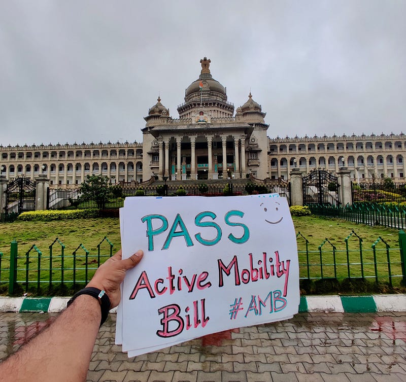

*PC: Abbas*

I wrote a couple of pieces in March 2021, [How do you invert the mobility pyramid?](https://medium.com/@sathya-sankaran/how-do-you-invert-the-mobility-pyramid-2c30509ca92) and [Active Mobility Goals](https://medium.com/@sathya-sankaran/active-mobility-goals-518c8f067cff). It's worth a read because it already sets the context for a law in India that can punt liveability in cities, closer towards the climate resilience end zone. What I would like to add to these in todays piece, is a bit of context and why the recently drafted Active Mobility Bill is important for Karnataka? The state where this bill has been drafted and is waiting to be made into law.

In 2019, Three decades after the introduction of the Central Motor Vehicles Act, Section 138 was [amended](https://egazette.nic.in/WriteReadData/2019/210413.pdf) to introduce the below clause

> 138 (1A) The State Government may, in the interest of road safety, make rules for the purposes of regulating the activities and access of non-mechanically propelled vehicles and pedestrians to public places and national highways

This not only meant there was a belated recognition of the rights of pedestrians and cyclists, but that it was considered important enough for Ministry of Road Transport and Highways to make the disclaimer in their act and pass it to a separate bill to be made by the states. By December of 2021 a [draft Active Mobility Bill](https://dult.karnataka.gov.in/uploads/media_to_upload1640773786.pdf) was ready in Karnataka, drafted by the Directorate of Urban Land Transport. The bill was put up for consultation promptly. A quick review showed it had taken best practices of bills from many countries like Singapore etc. and adapted it to Indian scenarios.

Karnataka, and Bengaluru in particular, is at a place in the arrow of time where the spotlight from across the world is shining on it. It has accumulated adequately diverse and rich human capital over the years to make it one of the top innovation hubs in the world. But a lot of people who come here for business from other similar ecosystems can be shocked at the lack of quality physical infrastructure that protects liveability of the talent it has accumulated. It is important for the state to make a strong statement that development priorities in Karnataka are not dissimilar from other progressive cities from across the world. The Active Mobility Bill along with the BMLTA bill and the TOD Policy provides that intent and direction. It sets up the regulatory framework for strong coordinated delivery of world class physical infrastructure for people of the state.

As of this writing, it is 9 days to the 2022 winter session of the Karnataka Legislative Assembly in Belagavi. Passing the Active Mobility Bill here indicates two more things. First, that there is awareness among the elected representatives to grab the first mover advantage and position the state as a progressive leader across the country and the world. Second, that in a legislative assembly with many competing issues, climate change and liveability in our cities are in the minds of the elected representatives and that they can allocate time for it. It will be a telling tale about the quality of our democratic process. Will the Assembly #MakeHistoryInBelagavi?

Do lend your support to the bill by adding your name below.

[**Active Mobility Bill**  
Decision maker: Legislative Assembly of Karnataka Ask: Pass the Active Mobility Bill in the assembly's winter session…](https://act.jhatkaa.org/campaigns/active-mobility-bill)
