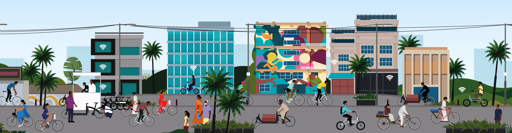

*PC: Catapult UK for Clean Air Street*

In my [last piece](https://sathya-sankaran.medium.com/how-do-you-invert-the-mobility-pyramid-2c30509ca92) I established the need for states in India to pass an Active Mobility Act. This will provide legislative sanction for affirmative action in transportation. What will such an act look like? For one it will have to ensure outcomes and not outputs. Outcomes that ensure walkability, cycle-ability and safety of the vulnerable on the streets. Audits will help accomplish this. Quantitatively and qualitatively measuring how safe you feel walking and cycling safely out of your gate, is the only way to establish we have reached the goal.

Wouldn't it help if the act mentioned mandatory footpaths and cycle tracks? Yes it will, but it may not cover the entire city. A [recent study](https://timesofindia.indiatimes.com/city/bengaluru/74-of-blurus-major-road-network-two-lane-survey/articleshow/74642816.cms) concluded, forty-three percent of roads in Bengaluru were ten meters or smaller. It is probably the same in other cities in India. What happens on these roads that won't allow segregated walking and cycling tracks? Vehicles and people will share them. An order by Bengaluru Traffic Police (248/TD/COP/2014) set the speed limit for passenger vehicles in Bengaluru to seventy kilometres per hour. Such blanket rules need to go and in its place graded speed limits introduced based on the intervention type. So the methods of ensuring walkability, cycle-ability and safety will vary in the city based on the neighbourhood and its road characteristics. Prioritising roads and designing the interventions with involvement of the local community will help scale this right.

Won't the city be non compliant the minute they pass the act? Because even at two hundred kilometres a year segregated infrastructure in major roads, which make up fifteen percent of the road length in Bengaluru alone, will take a decade to build. Yes, but it also provides an opportunity for the infrastructure builders, like BBMP & BDA in Bengaluru, to submit a time-bound action plan to rectify the same. It not only gives them time but also allows the public to hold them accountable for adherence of the same. This incentivises the builders to comply in the new areas and not repeat the mistakes. It is a win-win for all.

> Burden of proof in case of conflicts should rest with the motor vehicle.

Does infrastructure alone solve the problem? No, we also need to enshrine the rights of cyclists and walkers on the street. Any affirmative action has to transfer the burden of proof away from the vulnerable in case of conflicts and incidents. It signals the intent to protect their rights. The current norms treat people riding a bicycle, like motor vehicles, while they are just as vulnerable as people on foot. Public spaces ban cyclists from accessing pedestrian spaces. [Singapore](https://www.lta.gov.sg/content/ltagov/en/getting_around/active_mobility/rules_and_public_education/rules_and_code_of_conduct.html), for example, allows a person on a bicycle to use a shared pedestrian space with a reduced speed limit of ten kilometres per hour, twenty-five kilometres per hour on bicycle paths and ride on the road with motor vehicle speed limits. This flexibility allows people to know the rights and increase adoption. The need to define the rights of Active Mobility modes and penalties for abusing their rights must be strong and enforceable. This is the only way we can increase the rate of change towards a more liveable city.
