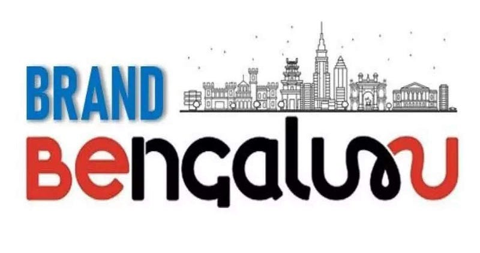

*brandbengaluru.karnataka.gov.in*

A brand is how people feel about the product or service which is backed up by performance that reinforces the trust and belief. Today people arrive into large cities in India for economic opportunities. Among other aspirations, the mobility aspiration is to own a motor vehicle and upgrade it to bigger and fancier cars. This ambition leads to a collective pressure on limited supply of infrastructure leading to reduced quality of service for everyone. If Bengaluru needs to differentiate itself in the country from other Indian cities as a brand in Mobility, it needs to be known as a city where Active Mobility modes like walking and cycling are prioritised, Mass Transport like buses and trains are prioritised. It cannot be known as the city where you come to drive fancy motor vehicles. This not only backs up the green titles it is famous for, but also puts itself as a climate friendly innovation hub where quality of life is valued.

The branding of a city has intangible and tangible components. Defining and articulating the intangible component sets the stage for the tangible components to back it up. The intangible definition would set the guard rails in how we build the infrastructure. For instance, if we want to make migrants or visitors arriving in the city to reach for a train/bus/walk/cycle map to explore the city or get to work, it will mean the government builds the appropriate infrastructure and enables provisioning of those services. Instead of building tunnel/elevated roads or destroying public spaces in the city to accommodate vehicular parking.

A lot of the inputs received in the city from citizens, are tangible issues. We are handed such poor quality of infrastructure and services in the city that most of the inputs are complaints on what isn't working. It's hard to imagine a branding with such quality. However, this is where the vision will help. It underlines the expectations on what a citizen living or visitor arriving in the city can expect in terms of prioritisation of infrastructure works and services. Nothing excuses bad quality of any infrastructure, but there isn't a silver bullet either. The entropic nature of citizens' mobility choices mean more options need to be provided by the government and the service provisioning agencies so it can allow the citizens to evaluate the opportunity costs of their choices.

How can the political dispensation define these intangibles? They are done in terms of outcomes rather than outputs. For instance, having access to public transport within 250m of every facility with reliable schedules is a goal that people can understand rather than a goal of buying 6000 more buses which is needed anyway to achieve the schedule and reach. Keeping the 2.5 mm suspended particulate matter below 10 micrograms per cubic meter by 2030 will lead to choosing projects that achieve those goals rather than a goal of planting ten thousand trees which will anyway be required to achieve the clean air target. And so on.

> Everybody talking to their pockets  
> Everybody wants a box of chocolates  
> And a long-stem rose  
> Everybody knows  
> - Leonard Cohen

However, all these assume that the political dispensation actually intend to realise the visions they want defined. If Brand Bengaluru is just to please a privileged [few designers and organisations](https://www.deccanherald.com/india/karnataka/bengaluru/world-design-organisation-inks-mou-with-bbmp-to-spruce-up-city-1240388.html) which want to put up some of their projects/events and the top leaders have already decided on their [tunnel vision projects](https://indianexpress.com/article/cities/bangalore/brand-bengaluru-tunnel-roads-one-ways-solutions-mobility-transport-8882809/), then all this visioning is just a smoke screen to distract citizens. We will do well to [watch the actors in this space](https://wdo.org/wdo-launches-new-global-programme-world-design-protopolis-in-bengaluru-india/), evaluate the projects under this campaign and their intentions, the adoption of the vision/outcomes by the government, to know if this is a red-herring. While we cant get our head out of the daily problems, can we challenge ourselves to think about the intangibles? Because thats what will bell this cat, not the projects. Let me know what you want a visitor to feel when the person lands in Bengaluru?

*I made an abridged version of this vision as as my suggestion recently in an opening remark at the Agile Bengaluru component of the Brand Bengaluru event. This was hosted by the mobility planning agency of Government of Karnataka, Directorate of Urban Land Transport, The city municipal corporation, Bruhat Bengaluru Mahanagara Palike, Indian Institute of Science and Sustainability Center of Ramaiah Institute of Management.*
