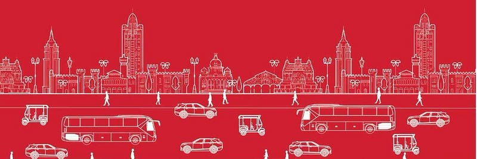

*Picture courtesy Bus4Us, a public campaign for increasing bus usage.*

### Bus for whom?

There is an increasing acknowledgement of the limits of personal vehicle usage in populated cities. All freedoms and comfort of personal choice come with attached collective problems it causes. In case of personal vehicles its the pollution, congestion and accidents to people who walk and cycle on the roads. This is not something an individual considers before buying a personal vehicle and this collective failure is something the government steps in to solve. Solutions involve enabling wider adoption of mass transport vehicles like buses and trains. Adoption of these modes which are not door to door requires people to have more information about the availability, accessibility, reliability and safety of these modes so they can switch at the cost and comfort of a personal vehicle.

A few enthusiasts on the sidelines of the [Bus4Us](https://twitter.com/Bus4us_BLR) campaign got together to address these issues using technology. A discord server called RAS-PT which stood for Reliable, Accessible and Safe — Public Transport was started on June 15th, 2022 to brainstorm some ways we can help public make the switch to public transport easier. Due to a lack of open data policy in transportation, dynamic schedule information was hard to come by from the authorities. So we began to look at static information like neighbourhood bus stops and bus route information.

A commuters journey begins at a bus stop thats close to him/her. Most people know there are bus stops in their neighbourhood but are probably unaware of how far they are, which one to go to or what buses come there. It is also common knowledge that the further away a bus stop is, the likelihood is higher that the commuter will choose other modes to a bus. Many countries try to provision a bus stop or train station within 250 meters of a commuter, we however assumed a 500 meter radius to evaluate the coverage of bus services in Bengaluru.

We used electoral roll data to understand living density. Electoral rolls have information at a booth level. Booths are designed to have around a 1000 people on an average. This allows us to understand at a fairly granular level the accessibility of bus stops to people. We tried to plot people who live within and outside this 500 meter radius.

> This interactive map put together by Vivek, Chaitanya Deep and Sathya Sankaran with advise from Satya Arikutharam is available for the public at <https://bmtc.vonter.top/bus_stops_accessibility/>. If you can code and wish to participate in visualisations do ping @tweetenator on twitter.

How might this be useful? While we continue to work on enriching this data set our goal is to make bus stops attractive with information that will help a commuter go to one. Over time if we do get access to schedule information we may be able to add it on. But we do not want lack of data get in the way of using what's available. While this data set is of people who are registered to vote, it will not cover those who are not registered to vote and destinations like offices and schools which don't figure in voter rolls. We are looking to extract commercial/institutional data sets as well to identify destinations and coverage for a last mile radius of similar dimensions.

How can the BMTC benefit? I have always maintained that ticket data only tells you who has already boarded the bus. There are many who have either come to the bus stand and not got a bus on time, or others who haven't even made it to the bus stop. This is where the information asymmetry hurts in getting more people into the bus.

> BMTC have larger issues of maintaining current schedules due to lack of priority lanes and staffing.

Additional demand will be a luxury if operational demands are not met. What this type of data might end up doing is allow modes like taxis and autos to pick up the slack. In the end Public Transport needs to step in urgently, failing which the city will be at a loss.
