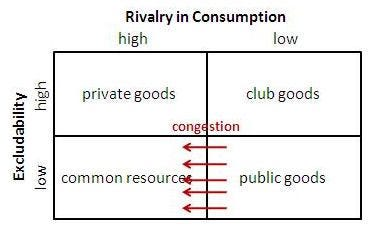

Entrepreneurs solving for climate change are struggling, because saving a resource you consume is not economically valuable to peoples self interest.

Let me explain. We know that climate change is about preserving resources we are over consuming or spoiling. For example, clean air is a public good. It is expected to be unlimited. But when we spoil it by putting out toxic emissions it ends up unclean. Cleaning the air for everyone is left to the government because of the free rider problem of public goods. A free rider is one where some people enjoy the benefits of clean air without contributing to keeping it clean when some others end up paying for cleaning it. Hence government collects taxes and applies penalties on everyone regardless of who is free riding. There are nuances on the type of penalties that can be applied only to free riders, but you get the idea.

*Natural resources are public goods*

*What has this got to do with entrepreneurs?* Mancur Olson wrote in this work "Logic of collective action", that, at scales such as a city or state or country, the free rider problem only increases. It works better when groups are smaller. So collectives are going to have limited success when they try to scale climate solutions as collective good. The economic system, however, which puts a value on natural resources, has not put a value on the lack of the resource.

*Why is this important?* Because once a value is either discovered or determined, it serves as a proxy, and allows it to be used in transactions. And transactions can be offered by entrepreneurs as a service or solution.

> But how can we value the lack of a resource? We have to discover the effects its absence causes.

For example polluted air is the absence of clean air and causes ill effects to whoever breathes it. If there was a strong, verifiable, citable, empirical correlation between the level of pollution in a particular location and its effect on an individual's health it is possible to create a value, as a cost to life. If this formula or correlation is available as a common good infrastructure, solutions can be built on top of it. For example associating Air Quality Index (AQI) value, or its change for worse, to the organ health or mortality of a person can lead to solutions by entrepreneurs providing preventive health services or location based real estate valuation services and more.

What we have done in this method is creating a currency of sorts for lack of a public good resource and turned it into an infrastructure commons that can then be consumed by a person out of self interest rather than collective good alone.

*Is this perfect?* No, there are always perverse incentives and market failures. But, we need to begin to take a crack at solving this ourselves as voluntary transactions too, because when it comes to climate change…

> "We all know what to do, but we don't know how to get re-elected once we have done it." ― Jean-Claude Juncker, Prime Minister, Luxembourg

If you wish to apply mental models to make better decisions, listen to the [explainer playlist](https://www.youtube.com/playlist?list=PLXiBZDcJdxbgRDEFhhf9aiuCSu0gRpqIv) of the [OoruLabs](https://podcast.oorulabs.com) podcast on [YouTube](https://www.YouTube.com/@oorulabs), [Spotify](https://open.spotify.com/show/6EYcxIPGW0UQvmkk67Ox0x?si=efbf1c2c47d449be) and [Apple podcasts](https://podcasts.apple.com/us/podcast/the-oorulabs-podcast/id1682407685). If you wish to receive updates you can join the [WhatsApp](https://chat.whatsapp.com/HquObSYDOFz5DXP6TEh07W) announcement community.
