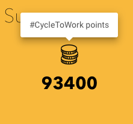

> If at the heart of market failure is a failure to negotiate, and all we have is a coercive agent, how can you use a coercive agent to perform a negotiation? asks Ajay Shah Co-author of the book "In service of the Republic".

Residents in various areas of Bengaluru are up in arms against bars and pubs which have come up illegally in residential zoning. The bars and pubs have been blaring music till the wee hours and using up the residential streets to park the cars of their patrons. This is a classic case of externalities of mixed use. While the RMP 2031, prepared by BDA, allows some of the roads in residential zoning that are wider than 15m to host C3 activities like bars and pubs, the negative externalities will continue to exist. The residents have been asking the state to intervene and solve the noise and parking issues by use of enforcement. This has led to the Police and BBMP shutting down music altogether and tow away cars, leading to some closures and general reduction in the economic activity of these areas.

Ronald Coase in his work *The problem of social costs (1960)*, proposed solving such negative externalities by negotiating a solution between the parties involved. There is a role for an ombudsman to help settle this matter between the business and residents without having to use the coercive power of the state, failing which we are now stuck in extreme positions. Removing valet service, promoting public transport, introducing shared bicycles, soundproofing indoor areas, not playing music in the open areas, using offers to promote responsible behaviour and do up the streets as social responsibility are all solutions that can come out of such negotiations.

> The coasian negotiation should be the first port of call for most issues, bringing in the state however seems to be the first and the last solution in everyones minds.

It is well known that the state lacks the ability to convene the society and markets and instead relies on the coercive power vested in them as the first choice. Because of an asymmetry of power between citizens and business, the power of the state is a convenient option. There isn't an ombudsman that can convene such a negotiation and the state is not ready to do this job effectively.

*These can be redeemed for social good*

#CycleToWork is trying an experiment to bring about a coasian solution to traffic problems in the city. While the platform incentivises employees who commute by bicycle to work, it has begun to now aggregate points at a company level for employers. The employers can now encash these points for social good of their employees and the city. Such platforms, can help be the catalyst for both the employees and the employers to participate productively in creating an environment of minimising the negative externalities for the society.

The onus is now on the industry to support such platforms and make it work, else we leave it in the hands of a coercive state which may not lead to an optimal outcome for all involved.
