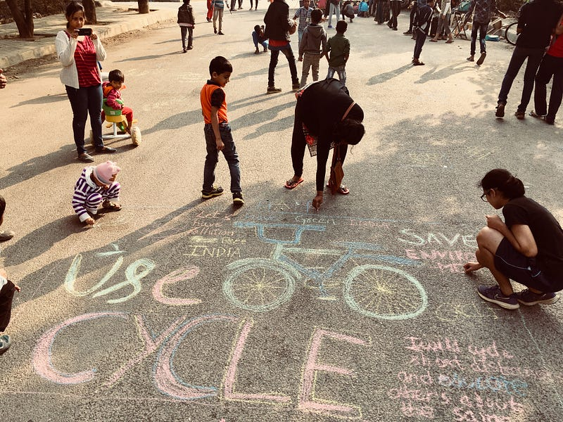
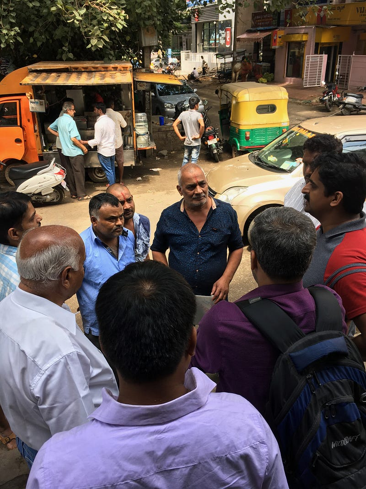

Peter Block describes citizenship as not just our act of voting but our ability to come together as a community to discuss possibilities and act collectively. While some solutions will definitely emerge, it cements the empathy and breaks down walls. In our quest for leadership, we have relegated our role as citizens to accepting top-down solutions with little engagement on the possibilities. While this has its own set of challenges, Elinor Ostrom calls for polycentricism as a way of governing ourselves. She has observed how communities getting together have solved the problem of the tragedy of commons. It removes selfishness and promotes common rules of engagement at a layer different from traditionally accepted forms of leadership.

*Scenes from Cycle Day Sanjaynagar*

[CiFoS](https://www.facebook.com/CiFoSCommunity) in Sanjaynagar has been working as a community engagement organization for several years. We realised early on that in order to fight collective action problems we need to work on social change. As Cristina Bicchieri says, collective action problems are exacerbated when what people think should be done, diverge from what people actually do. Only community action can bridge this divide. Large social change can be daunting. While climate change can be global in definition its actions start at the local and individual level. The [Cycle Day](https://www.facebook.com/blrcycleday/) and Walk to School initiative led CiFoS to look at community level problem solving and volunteerism. Schools of Sanjaynagar was a very good example of how CiFoS was able to gather 6 schools onto a common platform. This led to the schools and parents of 1500 children to contribute their bit to the environment. Surveys of one-third of the children after a year have shown increases of up to 37% in walking and 23% in cycling.

*Residents and Vendors discussing possibilities*

Kenan Malik says people have been led to believe diversity is a problem. But when they get together as a community, solutions of inclusiveness emerge. Food vending on a street in Sanjaynagar was seen as a problem by the residents. It manifested as us vs them. The "Chaat street" in Sanjay Nagar is an attempt by CiFoS to provide a safe healthy environment for street food vendors/consumers and make them a part of the identity of the community. Various people are coming together to pilot solutions. The larger plan for the street involves giving the vendors space and providing a car-free area. The whole exercise is being done with the involvement and support of the vendors and residents.

None of these interventions involves the traditional form of leadership. It comes ground up by the community and the government is a partner to oversee the common good. This is being worked on as a template for collective action rather than looking for leadership in traditional forms for solutions to problems.
