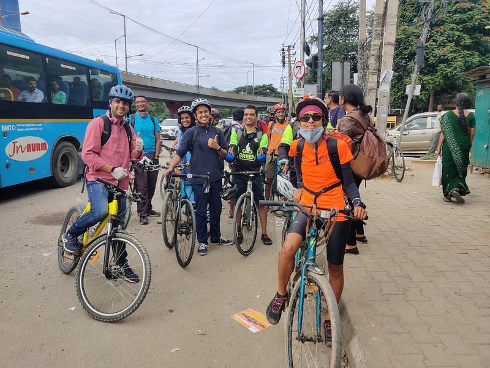

Every city across the world has a moment of reckoning when it comes to bicycling. The Dutch discovered it with the Kindermoord movement and the oil embargo in the 70's followed by many European cities. The Americans are discovering it as a way to reclaim the downtown core or the historic districts. The Chinese just can't afford anything else without overheating the environment. Whatever the reasons are, there is a mode share that bicycling will claim in the city of the future. India has been lagging behind in this effort. The mode share of bicycling is less than 3% in large cities. This lopsided mode share will present a massive environmental cost to the cities and become a drain on the productivity if it's not addressed immediately.

The **#CycleToWork** program launched last year has made tremendous strides in catalysing work commute in the city of Bengaluru. The <https://cycleto.work> platform allows Bicycle Ambassadors nominated in each company to take up leadership in scaling bicycle commute in their companies. With more than half the companies, that clock rides on the #CycleToWork platform, being situated in the IT belt, it was just a matter of time before the ambassadors wheeled up to make a statement.

*The first ever #CycleToWork critical mass riders making a statement*

The #CycleToWork Fridays kicked off today as a one of its kind critical mass event for bicycle commuters under the leadership of *Shilpi Sahu*, *Sameer Shisodia* and *Chidambaram*. The ambassadors of #CycleToWork who work in the area turned out in support and rode away to their workplaces mingling with hundreds of others who ride their bicycle to work. This will be a weekly show of strength that will build over time. This was an attempt to influence the authorities to make safe bicycling facilities along the Outer Ring Road corridor, where Bus Priority Lanes are being mooted by the government. Magic happens when leadership is decentralised.

Bengaluru Coalition of Open Streets (BCOS) was formed 6 years ago when Cycle Day began to make its mark in the city as the only open streets event in the country. 500 cycle days later there are 40 plus community partners who conduct open streets in their area making this the longest **continuously running open streets event** in the country. Along with a pilot of walk to school program which led to an increase of 23% in cycling and 34% in walking in the neighbourhood of Sanjaynagar, the time has come to scale all these into a tightly knit unit.

BCOS 2.0 is a collective that will bring together Bicycle Councillors from 198 wards in the city as voice for increasing local bicycling. They will help school and college Bicycling Champions to scale walking and cycling in schools. The #CycleToWork Ambassadors will work with companies to reduce their transportation externalities by getting people to commute to work. They will all work with the Government to make change happen. Watch this space for more.
