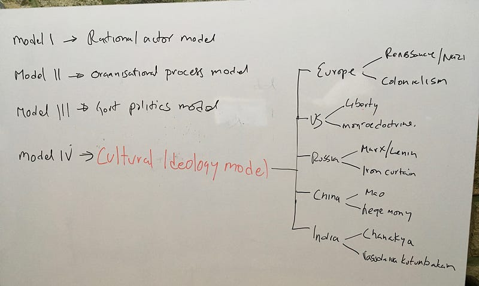

Graham Allison, describes [three models](https://ils.unc.edu/courses/2013_spring/inls285_001/materials/Allison.1971.Essence_of_Decision.pdf) of evaluating and understanding state actions. Model 1 is the rational actor model which posits government action as a rational choice out of the many possible options. Model 2 is the Organisational process model which explains government action as an output of the various organisations that operate within it and their decisions. Model 3 is the government political model which explains government action as the resultant of political pulls & pressures at the time of decision making. The conclusion is that while we tend to look at decisions as being of Model 1 simplistically, it is more likely an output from model 2 and 3 as well. He admits to not knowing where one ends and the other begins.

Lets take the example of the current crises in Maldives. Chinese presence in the country is a strategic concern for India. Maldives has forged [deep co-operation](https://nationalinterest.in/when-will-india-employ-hard-power-da19073c336a) with China and Saudi Arabia. India cant afford to let China establish a base in its backyard. Hence India is now on the back foot. Its a suitor who has lost out to China so far.

Incidentally, Its president Abdulla Yameen had also [clamped emergency](https://www.reuters.com/article/us-maldives-politics/maldives-leader-seeks-approval-to-extend-state-of-emergency-idUSKCN1G30N7) on 5th Feb and extended for further 30 days unilaterally after jailing all his opposition and Judges who ruled against him. He has practically turned the island nation into a dictatorship. So there arent enough independent organisational output in the nation for a model 2 analysis nor is there a political opposition to allow for an effective model 3 analysis inside his country.

*Model 4 — The Cultural Ideology model*

Maldives is a predominantly muslim country, contributing more islamic radicals, to terror groups, per capita than any other country in the world. Under the influence of Saudi Arabia, Salafisim has crept into universities and being [institutionalised](https://www.nytimes.com/2017/06/18/world/asia/maldives-islamic-radicalism.html) by the islamic ministry post the transition to democracy in 2008. It has a leader who is bulldozing opponents and alleged mouthpiece newspapers in his country are spewing [venom against India](https://timesofindia.indiatimes.com/india/political-storm-in-maldives-over-editorial-attacking-modi/articleshow/62184318.cms). Its intresting to note that the new friendship with china has nothing to do with cultural affinity. You cant pin the hostility towards India on one person. The airport building deal with an Indian company was repudiated in November 2012 by Waheed Hassan. It can not be put down to political views of Abdulla Yameen who took office in 2013.

Is it possible then that a cultural and ideological model can help unravel the levers we can use to get Maldives back to its India First policy which has virtually been abandoned? A nations behaviour is greatly influenced by its culture and its chosen ideology. Indias NAM, in the cold war and, Vasudaiva Kutumbakam now is so ingrained in our ethos, that our capacity building and policies mimic the sentiments. I posit that, analysing the changing contours of ideology and cultural biases, of the country and its people, can help us understand and find the right levers of influence in dealing with other nations.
