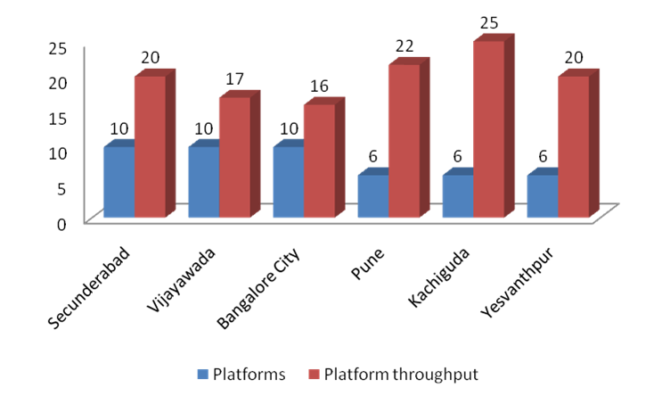

So CAG found out Indian Railways managed their operations poorly. Most people who travel by trains often enough know this is how they have been. One particular [report](https://cag.gov.in/content/report-no17-2018-performance-audit-augmentation-station-line-capacity-selected-stations), on inefficiencies at stations, points out that one of the bottlenecks in their track capacity and utilisation is station performance. This is not surprising since a bunch of us at Praja RAAG discovered this in 2010 while making the Commuter rail Call to Action [report](https://www.scribd.com/document/295208717/Bengaluru-Commuter-Rail-A-Praja-Report). We found Bengaluru city station and Yeshwantpur had the worst efficiency ratios among popular stations with comparable platform numbers.

*Throughput at various stations — Commuter Rail Call to Action report, Praja RAAG, 2010*

We found there were massive underprovisioning of tracks and signaling in the entire Bengaluru region which made the tracks heavily underutilised. There were switching issues at Yeswantpur station between trains heading towards Tumkur and the ones heading towards Lottegolahalli. The CAG report points to platforms and stabling lines not long enough to handle 24 coaches. We found that most trains remain parked in the main lines holding up platform space because of this and the fact that there aren't enough stabling lines to the volume of trains handled.

The railways have to manage efficiencies of [7329 stations](http://www.indianrailways.gov.in/railwayboard/uploads/directorate/stat_econ/IRSP_2016-17/Annual_Report_Accounts_Eng/Statistical_Summary.pdf) across India. It has a station redevelopment program. 22% of these stations are under redevelopment. [1253](http://www.indianrailways.gov.in/StationRedevelopment/AdarshStation.html) have been redeveloped under the Adarsh scheme and bids for redevelopment of [332 stations](http://www.indianrailways.gov.in/StationRedevelopment/AI&ACategoryStns.pdf) are being invited. As pointed out by the CAG all these upgrades are passenger amenities, not upgrades to track infrastructure. It is not clear what is the plan for track infrastructure upgrades at stations or what metrics are used to understand operating efficiencies.

The railways need to explore multi decking their track infrastructure at stations by utilising airspace or going underground. They could also consider moving a lot of the parking and passenger amenities to a different level and save ground space for track infrastructure. In case of this not being sufficient, they could move stabling lines to nearby stations. Like Chikkabanavara in case of Yeswantpur. Among other things, the CAG recommends that the railways need to explore alternative places to develop new stations and terminals in case there isn't sufficient land to increase capacity in existing stations. They could reroute traffic by creating new hub stations like the Bengaluru airport one recommended [here](https://medium.com/@sathya_sankaran/capital-and-its-people-f44da2bb945e).

The tenders under schemes for passenger amenities need to be scrapped until a traffic plan for the next 20 years is made for all lines in the country based on traffic projections. The solution will call for station specific brainstorming on the integrated track and passenger plan before awarding tenders under various schemes. At least the major metros where the population boom is expected need master plans so commuter rail can be accommodated. This is an opportunity to get back on track instead of getting derailed.
