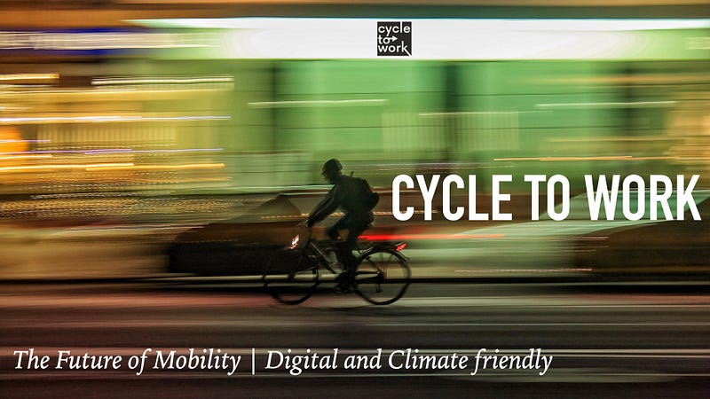
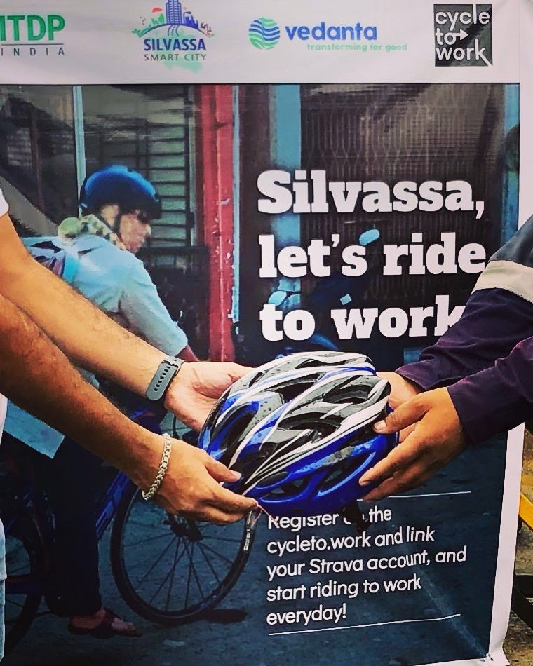
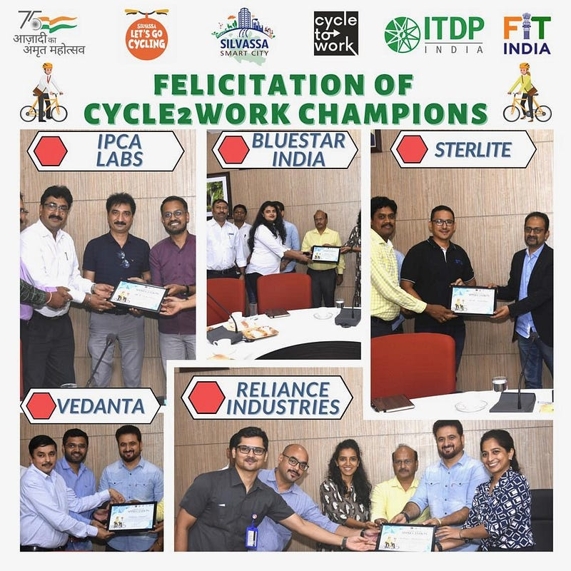

*PC: Luca Campioni, Unsplash*

Silvassa is at the crossroads. Nestled in the Union Territory (UT) of Dadra & Nagar Haveli (DNH), its industrialisation effort two decades ago has given it many businesses, from multinationals to SME's, which number more than 2500. The Special Economic Zones and Value Added Tax regimes gave the UT's a leg up over the years. A manageable area of around 500 sq. km and dynamic young administration, it took the opportunity to redefine itself. The [Cycle To Work platform](https://cycleto.work) was successfully piloted in June 2022 by [Silvassa Smart City](https://silvassasmartcity.in) and within a month saw a massive uptake.

The dynamic CEO of Silvassa Smart City [Ms Charmie Parekh](https://twitter.com/CharmieParekh) understood what the platform could do for her city. Technology provided the pan city scope that allowed a digital first scaling option. Cycle To Work platform provided her the capacity to measure the outcomes of the effort and use the data for decision making. The [Cycle To Work leaderboard](https://cycleto.work/leaderboard) gamified the process and made it competitive for industries to motivate staff.

> By the end of one month since the start of the rollout, some of the companies in Silvassa now stand in the top 10 among more than 450 companies across 60 cities globally.

Leaders like IPCA Laboratories, Bluestar, Reliance Industries, Sterlite Power, Sterlite Technology, Vedanta and Hindustan Unilever put their weight behind the transition to a climate responsible and Environmental, Social & Governance compliant world of the future. It remains to be seen if DNH can show the way, build safe cycle friendly infrastructure, remain attractive to a new age labour force and remain competitive in a heavyweight industrial neighbourhood.

*PC: Silvassa Smart City*

Meanwhile, [New Town Kolkata](https://www.nkdamar.org/Pages/index.aspx) is not far behind. They are kickstarting their journey into a sustainable future next week with [Cycle To Work](https://cycleto.work) providing the data led decision making backbone in their transformation. This is aided well by [ITDP India](https://www.itdp.in) who have been assisting these cities in their transformational journey. The future belongs to cities and towns that use a bicycle focussed urban form as a competitive differentiator and use data to make decisions.
