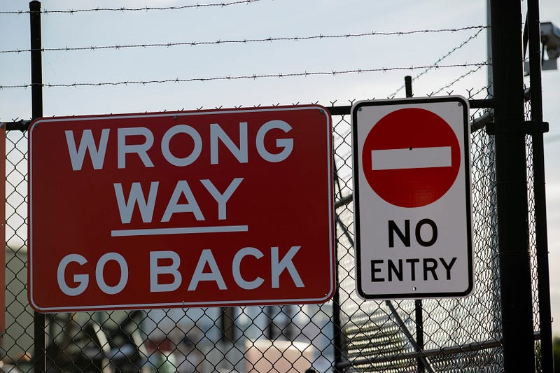

*Photo by Marcus Reubenstein on Unsplash*

Do we have to be rich as a country before we get footpaths, bicycle lanes and bus lanes? I have been hearing this a lot recently. In fact by this logic metro trains and good quality roads should wait till we get rich because they are a luxury in a poor nation. Transportation infrastructure gets more expensive as the GDP grows and higher the per capita income gets. Inflation adds to the cost of materials too. This is why it too expensive and time consuming to build anything in the developed world. Its the side effect of getting rich. It pays to realise two things.

One, the increasing fuel import bill is only reducing our GDP growth by diminishing the value of our exports. Additionally, energy sufficiency is increasingly a national security issue. Our energy needs are only going to increase. Moving towards sustainable non-fossil fuel energy generation and using them wisely gives our country leverage in growth.

Two, the compelling argument for increasing allocation of road space for bus, tram, train, cycling and walking is efficiency in use of government spending. Today, spending on road infrastructure for motor vehicles alone is causing tax rupees to be inefficiently used. As a emerging nation its something we can ill afford. Not only is this reducing budgets for primary governance functions like health, education, and law & order, but its rapidly increasing negative externalities like deteriorating air quality, increased mortality and excessive productivity loss and stress. The welfare functions are completely broken in states as a consequence of this.

So where does free market in transportation fit in? Trading your money for a personal motor vehicle of any size and shape is a transaction between two willing parties. Any democratic country should allow that choice.

> The buck however stops when these individual transactions in large numbers have a negative influence on the rights of others not engaging in this transaction.

For example large number of people driving motor vehicles on the streets take away space from people who want to walk, cycle or take public transport out of their own free will. This situation is called [tragedy of the commons](https://youtu.be/CxC161GvMPc), [collective action problem](https://youtu.be/Bs8IFXYA6d8) or a [market failure](https://youtu.be/rJixtB0GluQ).

The government is put in place via social contract with the people. The expectation is that in case of such conflicts where ones personal choice is infringing on the rights of others choices, the people will cede their rights in order for the government to remove this imbalance. My right to smoke in public because of a free market transaction between me and the cigarette manufacturer stops when others who don't engage in this transaction are affected. My right to drink and drive stops when others are hurt by my actions. My right to use a motor vehicle stops when people who cycle and walk cannot safely do so anymore in shared commons.

> In Bengaluru and other large cities in India, unbridled personal vehicle usage has caused market failure.

The government has the right to reallocate road space. So we don't need to be rich for the government to do its fundamental duties. Any right thinking free market proponent would ask the government to take the lead and make this equalisation happen when the costs are low. It is also interesting to note at this point that transport sector does not have an effective regulator like, finance, energy, telecom, aviation etc do. Karnataka is the first state to get an appropriately empowered [Bengaluru Metropolitan Land Transport Authority](https://medium.com/@sathya-sankaran/rewards-of-collaboration-e6fcdfc0eaf0) (BMLTA) this year, which will don the role of a planner and regulator for land transport.

There is an opportunity to generate and consume energy wisely, set our transport governance on the right path. This is what will make us a leader in the future of transportation, not some free market grandstanding.
