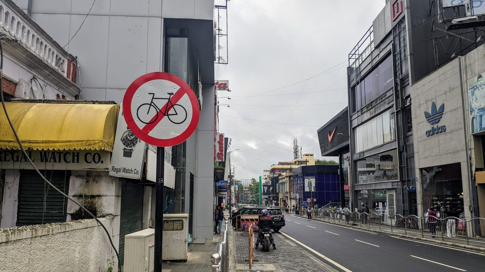
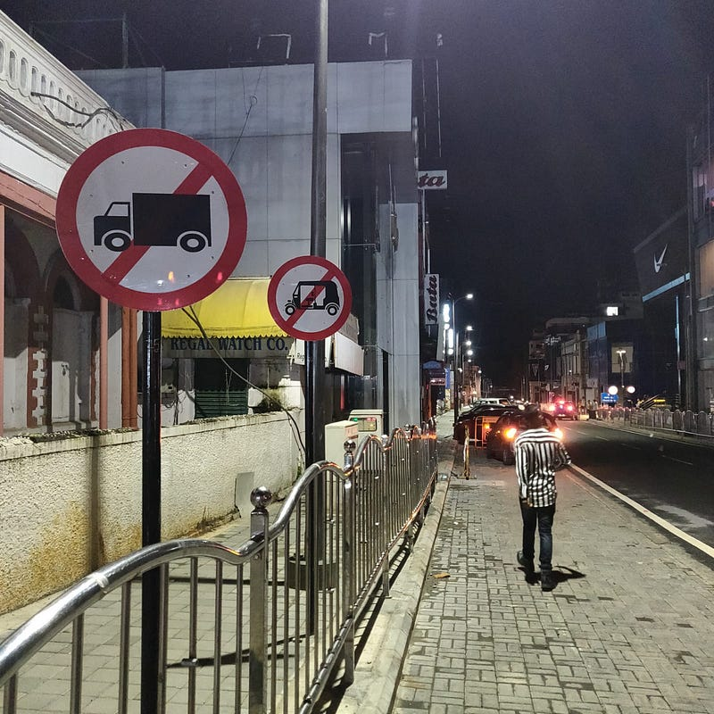

*PC: Nihar Thakkar*

Over the last few years, Bengaluru has been trying to make concrete moves towards becoming more Public Transport & Active Mobility friendly. The [Cycle Day](http://www.facebook.com/blrcycleday) and [Cycle To Work](https://cycleto.work/leaderboard) programs led to increase in attention towards cycling infrastructure in the city's Comprehensive Mobility Plan and Pop-Up cycle lanes during the pandemic. The city's first car-free street Church Street First also brought economic recovery back to businesses post the pandemic induced slump. The cycle tracks in the CBD caught the attention of the National Smart Cities Mission and brought Bengaluru a light house city status among 100 others.

A no-cycling signboard was spotted at the entrance of Brigade road in the Central Business District of Bengaluru by cyclist Nihar Thakkar. It is unbecoming for the city authorities to even mistakenly put up such no-cycling signboards that shows us in very bad light across the world. With climate change wreaking havoc there is urgent need to increase the rate of building pedestrian and cycling friendly infrastructure in the city. Hope this sign board is brought down soon and we put up pedestrian and cyclists only signboards in more places in the city.

In order make the city more walking & cycling friendly I formed the Council For Active Mobility or CFAM along with other cyclists. This was formally inaugurated via video conference by V Manjula, IAS & Commissioner, Directorate of Urban Land Transport on 17th July 2021. It consists of Bicycle Councillors from 30 wards in the city under a program which was launched by the Deputy Chief Minister Shri Ashwath Narayan in March 2020. CFAM will work towards auditing pedestrian and walking facilities in the wards and run communication campaigns which get more people to ride a bicycle in the city for daily activities.

*PC: Haresh Kukreja*

I had posted the no-cycling image on [Twitter](https://twitter.com/bicyclemayorblr/status/1416678755158827009?s=20) in the morning and pinged the Member of Parliament for Bengaluru Central and the Deputy Chief Minister via DM. The MP for Bengaluru central [responded](https://twitter.com/PCMohanMP/status/1416697406905745408?s=20) both publicly and on DM, acted fast and got the signboard [removed](https://twitter.com/PCMohanMP/status/1416811473452494850?s=20) quickly before the night fell. Sridhar Vivian of Bangalore Mirror [spoke](https://bangaloremirror.indiatimes.com/bangalore/others/no-cycling-sign-on-brigade-road-was-just-a-big-mistake/articleshow/84538839.cms) with officials about this incident.

> "A senior traffic police official said that the Brigade Road is open for cyclists and the board was mistakenly put up by the Smart City workers."

With this incident, virtue signalling for cycling is established in the city. Even if the steps forward are slow, we shouldn't be taking steps back. The challenge now before CFAM is to accelerate the forward movement.
