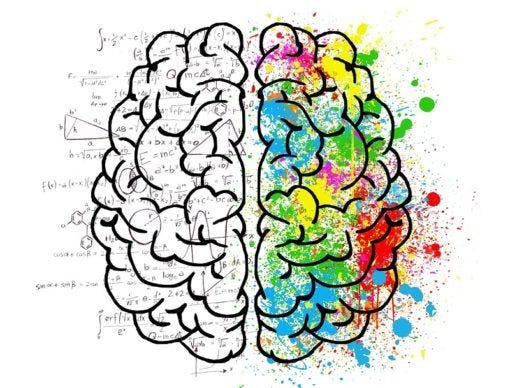
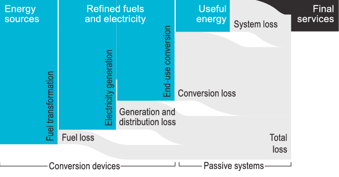

*Credit: Rawpixel.com*

Symbiosis is a word I learnt in primary school science class which was taught with an example of how the clownfish lives inside sea anemones using it for protection and feeds on small organisms that might harm the anemone. On land, plants also rely on nitrogen fixing bacteria in their root nodules to enhance its growth. Many such mutualistic symbiosis are abound in nature. Humans rely on plants to generate energy from photosynthesis and consume the stored energy to generate power in our bodies for building mass, strength or generating movement. The most important symbiotic relationship between humans and plants is the ability to exchange oxygen and carbon dioxide between them. Simple science but complex web of relationships inside each of these from the microscopic to the macroscopic, completely evolved in nature over billions of years, put together, one piece at a time.

We have built complex energy and economic systems, but along the way we seem to have forgotten why this symbiosis exists. It is efficiency. The path dependency is built on top of specialised functions. Comparative advantages in economics allow for this specialisation in the value chain. Today your cellphone contains 75% of the elements from the periodic table from almost 20 countries across the world. This complex system is however built on lowest cost not highest efficiency. We are so energy hungry that we want to produce more and not focus on utilising what we have. Like Vaclav Smil, the author of the book Energy and Civilisation says, No human civilisation could ever sever our dependence on photosynthesis.

At a recent conference a professor told me his job is in danger because Artificial Intelligence will provide all the answers that he currently provides. It's partly true, some jobs are in danger, but I think we are far from putting all jobs in danger. According to a [report](https://www.delltechnologies.com/content/dam/delltechnologies/assets/perspectives/2030/pdf/Realizing-2030-A-Divided-Vision-of-the-Future-Summary.pdf) published by Dell Technologies and authored by the Institute For The Future, 85% of the jobs that will exist in 2030 haven't even been invented yet. The Large Language Models, for example, that parse information and make up answers are in such primitive stages that they cant even accurately predict [how many 'R's are in strawberry](https://www.reddit.com/r/mildlyinfuriating/comments/1etsdee/ai_trying_to_gaslight_me_about_the_word_strawberry/). I just did a Google search to find out that a single prompt to ChatGPT is estimated to consume as much energy as 40 mobile phone charges. I just consumed 0.3 watt-hours of electricity doing that search. If ChatGPT were integrated into the 9 billion searches done each day, [the IEA says](https://www.vox.com/climate/2024/3/28/24111721/climate-ai-tech-energy-demand-rising), the electricity demand would increase by 10 terawatt-hours a year — the amount consumed by about 1.5 million European Union residents. Imagine how our efficient trained brain uses energy from our morning breakfast to find out how many 'R's are in strawberry. If this where we are going with Artificial Intelligence we have such a long way to go for truly performant Artificial General Intelligence that doesn't bring down the planet within a few hours.

So what's in it for the people who sell GPU's today? Why isn't that money going into creating more energy efficient systems of the future? Matrix multiplication, for example, makes up roughly 45–60% of the total runtime of many popular transformer models like BERT, CLIP, and even ChatGPT, says this [post](https://www.modular.com/blog/ais-compute-fragmentation-what-matrix-multiplication-teaches-us). They are also critical to computing the convolution operation that forms the foundation of most computer vision models, and makes up the backbone of many high-performance computing applications. If we had to take a leaf out of natural systems, finding more efficient matrix multiplications, cost functions etc are the key to energy problems we are creating with our discoveries. We are at very primitive stages of AI revolution. We are still playing in the sand pit of evolutionary day care.

> "Predicting what the world will look like fifty years from now is impossible. But predicting that people will still respond to greed, fear, opportunity, exploitation, risk, uncertainty, tribal affiliations, and social persuasion in the same way is a bet I'd take." — Same as Ever: A Guide to What Never Changes by Morgan Housel

To mimic biological efficiencies we have on the planet, we need to reimagine what the industrial revolution produced. The path dependencies that our inventions have produced has taken us away from fundamentally reimagining the human created, energy harnessing and consuming products we have around us. We all hear about energy efficiency, but here is a new term I learned. Exergy. Even the medium spell check is correcting it to Energy as I type it.

*Source*

Exergy, can be thought of as a measure of the usefulness or quality of energy. [Cullen and Allwood](https://econpapers.repec.org/article/eeeenepol/v_3a38_3ay_3a2010_3ai_3a1_3ap_3a75-81.htm) showed that in 2005 out of the 475 exajoules of energy generated by humans in the world only 11% was usable energy rest was conversion losses. Thats it. 90% of energy we produce is down the drain. This is also known as the exergic efficiency. According to a 2019 study, India's industrial sector has an overall exergy utilization efficiency of 24–75%. The residential sector is the least exergy efficient at 13%, followed by transportation at 22.5%, and utilities at 33.5%. How do we now fix our systems to not waste all this energy? How do we get the GPU makers to invest in improving efficiencies? How do we avoid perverse incentives in our economic system that chases new energy and wastes what we have? This is where the future lies. The chase is not energy transition. It's how we consume energy and how much we destroy in the process of consuming it. You don't need IPCC reports to predict the damage, we can go back to fundamental laws of thermodynamics from Physics class.

There is another word I learned in science class, parasitic relationship. Examples are virus which bring us down. The body fights it. I'm fighting one as I write this. Hope we are able to distinguish between parasitic and symbiotic relationships and move towards the right one, so we can survive long enough to build a better "us".
