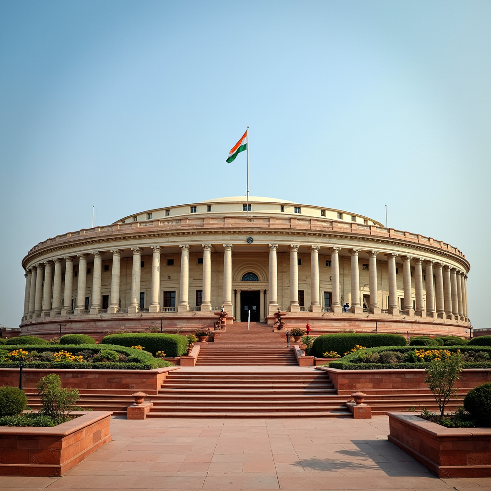

The Finance Commission is required to make recommendations on: (1) Sharing of central taxes with states (2) Distribution of central grants to states (3) Measures to improve the finances of states to supplement the resources of panchayats and municipalities (4) Any other matter referred to it.

First, the maximum noise created was the last line in the TOR which stated "The Commission shall use the population data of 2011 while making its recommendations." In the past four decades, eight finance commissions used the 1971 populations to compute the share. Why is 1971 important? Family planning was introduced at a policy level after this year since the population was booming. Some states were doing quite poorly and hence had an upper hand in allocations based purely on population. While States like Uttar Pradesh, Maharashtra and Bihar have more than doubled their numbers, southern states like Tamil Nadu, Karnataka and Kerala have relatively slower growths. Hence the 42nd amendment froze this year census as the base for all calculations. Further the 84th amendment extended this to 2031 census. The 14th finance commission however didn't fully rely on 1971 population. The UPA ToR gave it the option to move beyond 1971 census numbers to fully capture the demographic changes. In their presentations, of 29 states, 13 opted for 1971, nine for 2011 and seven didn't want any weightage to be given to population.

Second, in the ToR, 7(ii) states "Efforts and Progress made in moving towards replacement rate of population growth". Its subjective to measure efforts and objective to measure outcomes. Further, out of the 29 states in India, 18 have already reached replacement rate, with two more states close to the 2.1 mark. Most states, therefore, will be ineligible for incentives as they are past this mark. The five states that will gain by the use of 2011 population figures are the same five high population states whose TFR is above the replacement rate of 2.1.

Third, term 5 in the ToR states "The Commission may also examine whether revenue deficit grants be provided at all." So far, revenue deficit grants were provided by the center to ensure the states used their borrowing to finance capital instead of closing revenue deficits. While, removing revenue deficit grants forces the state to fend for itself by enforcing fiscal prudence, they are in violation of Article 275 and Article 280 (3) (b) of the constitution. Article 275 enables the state to invest in backward areas which increases the chances of a deficit. Article 280 (3) (b) allows the Finance Commission to state the principles of allocation and not to remove it.

Fourth, term 6 (iv) states "The impact on the fiscal situation of the Union Government of substantially enhanced tax devolution to States following recommendations of the 14th Finance Commission, coupled with the continuing imperative of the national development programme including New India — 2022". This is a movement initiated by the central government. It has six components: (i) poverty-free India; (ii) dirt and squalor free India (iii) corruption free India (iv) terrorism free India (v) casteism free India and (vi) communalism free India. All of these will need state participation to ensure success. Reducing the state share of taxes to achieve these outcomes and channelling them to the center is counter productive. It has high likelihood of disincentivising the states to achieve outcomes. Most of these require investments without an equivalent revenue potential and will need to be supported financially by grants.

Fifth, term 7 states in (viii) "Control or lack of it in incurring expenditure on populist measures" These are subjective terms. What is populist? The definition of populist is undefined and some populist measures like PDS have become social security and incorporated into state policy. The state government is within its constitutional right to provide such schemes. It also goes against a Supreme Court ruling Bhim Singh v Union of India and Others. The court has stated in that order "The court can strike down a law or scheme only based on its vires or unconstitutionality but not on the basis of its viability. When a regime of accountability is available within the Scheme, it is not proper for the Court to strike it down, unless it violates any constitutional principle". The only constitutional recourse to prevent populist schemes is to present an ideological, fiscally prudent, alternative to the voters.

Finally, its important to note that while some of the terms of finance commission are trying to get the states on a path to fiscally prudent alternatives, some others like 7 (iii), "Achievements in implementation of flagship schemes of Government of India, disaster resilient infrastructure, sustainable development goals, and quality of expenditure", tries to force some central schemes down the throat of states violative of the freedom of the state governments constitutional rights. It is more useful if the incentivisation for growth and prosperity came by competition between states for economic prosperity and the trajectory of the same was left to states. The societies in each state have a way of living based on their history and culture. Its best if the variety in approaches are not scuttled by uniform prescription.

## References

• Challenges before the Fifteenth Finance Commission, V Bhaskar, EPW, March 10, 2018

• Central Transfers to States: Role of the Finance Commission, Gayathri Mann, PRS Legislative, April 11, 2018

• New India @ 2022, Rajiv Kumar, Oct 12, 2017

• Bhim Singh v Union of India and Others, Para 76(3), Supreme Court of India (2010), INSC 358, 6 May 2010
