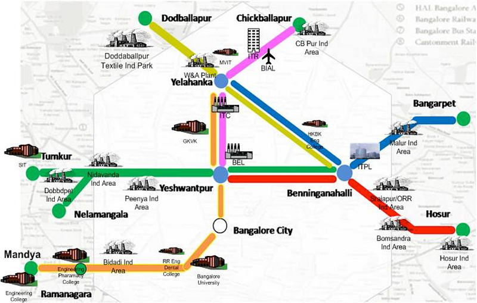

[This report](http://www.indiatogether.org/rail-coal-link-economy) states 44% of Indian Railway freight revenues come from coal transport. The railways use freight revenues to keep passenger fares low. With renewables increasing its market share, it is but natural for the coal traffic to dwindle. This will have upward pressure on passenger ticket prices. Today, passenger day train tickets to Chennai from Bengaluru can be less than one third the bus fares and the buses run full. So even if the train ticket prices doubled, the price would still be lower than the equivalent in bus. Secondly, this brings up an interesting question of how much rail is being used in the country.

[Per this report](http://www.vikalpa.com/pdf/articles/2005/2005_jan_mar_17_33.pdf), in India, over the past 50 years, while cargo and passenger traffic has gone up 6 times, the modal share of rail for both has come down by 70%. Historically ships & trains have hauled heavy cargo. A single train car can [haul the equivalent](http://www.vanshnookenraggen.com/_index/2018/02/build-transit-where-its-most-effective-not-where-its-least-expensive/) of 4 large trucks. Cargo equivalent of two trains carried in trucks can cause a 25km long bumper to bumper traffic and attendant pollution.

*Suburban rail passing through industrial zones. Source: Praja RAAG*

One look at the Bengaluru Suburban rail map shows the number of industrial zones covered by it. Notwithstanding long-distance cargo, if [the proposal](https://medium.com/@sathya_sankaran/capital-and-its-people-f44da2bb945e) of making KIA a cargo hub takes shape, the efficiencies it can bring to the local economy is immeasurable. With e-commerce companies [looking at using trains](http://www.newindianexpress.com/cities/bengaluru/2016/sep/20/Startups-beat-Flipkart-in-taking-Metro-space-on-rent-1522512.html) and setting up delivery centers at the stations it opens the last mile delivery to cargo bikes and electric bikes. For 12 to 15 thousand crores, 400 kms of the suburban rail network can carry 15 lakh people on 300 services every day. This is half the amount being proposed for the elevated corridors and 4 times the distance. The network touches 10 of the 12 arterial corridors that radiate out of Bengaluru. With a interchange cargo hub at KIA and delivery hubs at the radial corridors there is a good case for the train to relieve the pressure on the roads in the city - both passenger and cargo.
