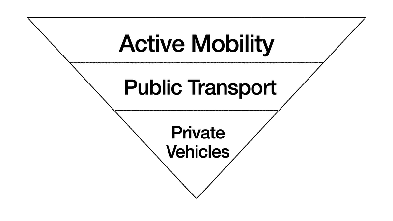

*The inverted mobility pyramid for liveable cities*

We well know that the transportation choices we have made over many decades, and continuing to make, have caused pollution & congestion in India. Air pollution in the cities caused by fossil fuel vehicles is a major contributor to deaths and impairments in adults and children. We cannot be tolerant of avoidable deaths. Abuse of valuable commons like the street by powerful and highly inefficient modes, a segment of population can afford, is a characteristic of congestion. This abuse of street space, by a section of motor vehicles excludes a set of people who need to walk, cycle or take public transport from using the commons. Both are costs imposed by a certain section of population on others. This is a classic failure of principles of equity which holds our society together.

What does this equity mean, and how does this look to you and me? Over the years that we have built road infrastructure, we have prioritised building roads with asphalt. This allows one to drive a vehicle out of the gate. Every gate has a road outside it. This is a given in most cities in India. However, the same is not true for walking & cycling. You think twice before opening your gate and start walking or cycling without feeling unsafe. Even if you do, you wouldn't allow your kids or elderly or the differently abled on the streets without concern. This is the manifestation of inequity for you and me.

We cannot build a city for athletic young people or for motor vehicles alone. A city brings mobility to all people, regardless of economic status, age, gender or abilities. This is what every city across the globe is striving to build; a place that respects people and their interactions. We know where we went wrong. We believed individual choices in the public commons will not have collective consequences. This is a classic case of a collective action problem.

> **If you continue to think like you've always thought, you'll continue to get what you've always got**.

Why are we unable to invert this pyramid where walking & cycling will take precedence? The government cannot continue to believe in the market, correcting a collective action problem caused by it. The infrastructure builders need to show leadership in correcting this inequity. Restoring a market failure needs the state to act.

What might be the concern for the establishment? Getting away from decades long practice will need people to abandon their existing well-oiled behaviours. It is important to note here that a footpath houses water, sewage, electricity, telecom, lamp posts, furniture, trees, entrances to properties, people, cycles and much more; but willingness, prioritisation, space & money allocation is the lowest for this. The contracting mechanisms and thought process among the engineering cadre steers the city to build more of what they have always done, pour asphalt. There is also a perceived behavioural bias. Owners of motor vehicles believe it will deprive them of the mobility they are used to. It's called loss aversion. To them, having nice infrastructure to walk or cycle doesn't offset the comfort of driving out the gate. Decision makers, who themselves are used to driving, amplify this impression, forming an echo chamber they cannot get out of.

One of the most powerful ways for the state to correct this is to enact legislation to bring back equity to the streets. It needs to prioritise building pedestrian and cycling infrastructure as an affirmative action over any other investment. Affirmative action ensures quota by law. In case of transportation, it needs to allocate space for walking and cycling in all the streets, both retroactively and in the future. This could take various forms from dedicated lanes to sharing the streets by slowing down the motor vehicle traffic. Not just as a guideline from Indian Roads Congress, but as a mandate. It also protects walking and cycling with a legal cover that penalises abuse of these allocated spaces.

What would it take to make the law? It will take lawmakers to think outside the car. We might own a motor vehicle, but we cannot think for everyone from inside it. Especially when it is the source of failure and imposes a cost on others. It's time for a law that promotes active mobility as an affirmative action.
