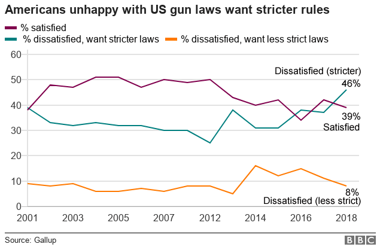

The US gun debate is an excellent example of how [model 4](https://medium.com/@sathyasankaran_79926/the-cultural-ideology-model-953e9e03a6f0) can be used to analyse why the country is unable to come to terms with the most logical way to solve it, amending or repealing the 2nd amendment. I posit in model 4 that understanding the cultural and ideological situation in the society bears a huge influence in government action.

Most analysis of the situation blames the government in power for not solving the root cause; amending the right to bear arms. [Some lawmakers](https://www.salon.com/2015/06/21/karl_roves_second_amendment_shocker_the_only_way_to_guarantee_that_we_would_dramatically_reduce_acts_of_violence_involving_guns_is_to_basically_remove_guns_from_society/) have also suggested acting on this. In order for them to do it, per Article V of the US Bill of Rights, any amendment needs to get 2/3rd votes in both the House & Sentate and then ratified by 3/4 of the states in the country. Some others believe the Republicans are responsible because of the pulls & pressures of their ideology. The NRA is the other entity blamed for all gun related violence. While they do fund politicians and lobby, they get most of their power from the market; the civilians who buy guns.

The US is awash with guns, more than any other country in the world. A [recent study](http://www.bbc.com/news/world-us-canada-41488081) put the ownership at 90 guns per hundred civilians. There is a huge percentage of the population which still believes in their right to carry arms. The market for guns is so large and so many of the people already own guns, that any change which appears to take away their ability to own guns is met with suggestions on alternate softer solutions from these very people.

*Will this translate into amending the constitution?*

A Gallup poll showed that there is dissatisfaction with current laws on guns. What does that mean? [This poll](http://news.gallup.com/poll/1645/guns.aspx) by Gallup shows **71%** of the US polulation in 2017 do not believe there should be a law which bans gun ownership. In fact this feeling is more now than in 1959 when only 36% believed they needed to own a handgun. Even strict gun control rules only get a split down the middle with **49% against** such measures. What does the representative of the people then do?

Sheriff Andy Taylor might have an answer?

In conclusion, all solutions towards a safer society in the US will never work until the cultural and ideological views towards owning a gun changes in the masses. This is a collective action problem. Until this is sorted, all explanations of why civilians are being murdered should lie directly in the laps of the people themselves. They love their guns too much to make the change. At the end of the day, NRA and politicians are just scapegoats.
