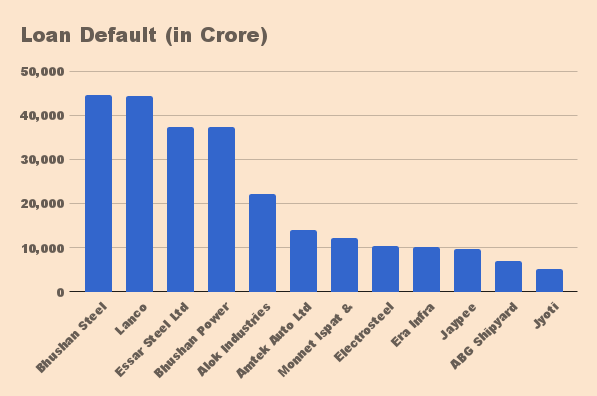

Non Performing Assets happen when the banks are unable to recover the loans disbursed. This happens for 3 reasons.

1. The sector and the economy changed along the way which altered the demand for the product or service.

2. The idea was bad in the first place and the decision to lend to this business was a bad appraisal.

3. Wilful defaulting and fraud by promoters causing a moral hazard.

Today, in India, stressed assets or bad loans are more than [10 lakh crore](https://www.firstpost.com/business/banks-bad-loans-pile-crosses-rs-10-lakh-crore-up-rs-1-39-lakh-crore-in-march-quarter-the-npa-mess-explained-in-7-charts-4496431.html) of which 90% are on the books of public sector banks. While the stressed assets were 8.5% of the total lending in March 2015, it rose to 9.5% by December 2016 and is 11.8% as of December 2017. It's a growing problem.

Some experts believe that the bad loans always existed and surfaced because of Raghuram Rajan's Asset Quality Review (AQR). Some others blame the slowdown in the economy in 2008 as the reason for the growing NPA's. Nevertheless, such high NPA's can put the lending system out of whack. With investigative agencies putting pressure on the banks, the lending by banks has now come to a 60 year low because banks are afraid to lend. Large project financing is taking a hit and they have moved to lend to the retail sector where ticket sizes are smaller. This can have an impact on capital investments and basic infrastructure sector services like construction, power, steel & cement. The impact of less liquidity in the economy is slower growth.

There have been many suggestions to reduce these NPA's. Asset Reconstruction Companies (ARC) have been set up in the private sector. These companies buy out the bad loans of specific companies from the banks for a fixed fee. There are 19 ARC's in the country but their capital base isn't large enough for the kind of NPA's with the banks currently. They have limited success in cleaning up large accounts.

One suggestion is to create a bad bank to take over the bad loans, at least the big ones. This is just kicking the bucket to another agency and cleaning up the books. If its just another bank what will it do differently? There is an incentive mismatch, while an ARC wants to buy low, banks want to sell high. The ARC has the luxury of cherry-picking the assets they want to buy, the problem with a bad bank for large borrowers, is to find someone to capitalise it. Haircut of big assets which will be sold at a discount is large. Who will take the loss and where will it come from? The standard answer is to dip into the consolidated fund. But this can only be done if there is a strategic interest for the country like Defence or Power. Even then every time we have the state stepping in, the moral hazard only increases.

12 large borrowers account for 25% of the bad loans in the country. 200 of them owe more than 500 crores each to the banks. Take the top 3 debtors for example. They span Steel, Power, Construction and Automotive. If the basic infrastructure sectors are running bad there is something wrong with the economy. Its hard to believe these sectors are not having demand in a growing economy.

*Source: Financial Express (Apr, 2016)*

Bhushan steel has been acquired by Tata Steel and is showing results churning out operating profits under new management. So management change has worked here. Bhushan power & steel owes 45K crore but the highest bidder is only around 19k crore. This is a big haircut for the banks if it goes through. The provisioning for this can only be done over time. The National Company Law Tribunal (NCLT) and the Committee of Creditors are working through Lanco to seek resolution plans. It's a going concern with 8000MW of power being generated. Any unviable business needs to be shut down but what happens to the shortfall in the power due to the shutdown and the jobs it has generated?

These examples show that treating the NPA recovery as purely a financial restructuring exercise is missing the forest for the trees. The business needs to be looked at sectorally and specifically for bad actors or practices. The turnaround or liquidation depends on the situation and buyers for the business. There have been suggestions to tackle companies based on the ticket size of the bad loans. The ARC's are already tackling the middle & bottom end. Banks are doing write-downs gradually. But the NPA's are growing not reducing. Continuing the write downs, looking for suitors and restructuring where possible on a case by case basis is the answer. But this will work on the stock only if we stop the flow in NPA's.

We need to stop making mistakes going forward. In a country like India, moral hazard is a real issue. With informal lending systems and lack of integrated technological data on companies, due diligence is tedious. Cases like Nirav Modi just makes it that much harder to solve the problem. Not to mention political interference and influence peddling for loans. Most large loans happen by weight of connections and less on merit. This is the primary reason for the PSB's having more NPA's. Even private banks have NPA's so privatisation of the PSB's is not a silver bullet. Consolidation is already taking place to remove the number of touchpoints for bad decisions. But reducing bad decisions by better due diligence and timely monitoring and reactions to downtrends is the only answer.

An E&Y forensic survey states, 87% of the respondents believe that the NPA/Stressed asset numbers are due to a diversion of funds to unrelated business or fraud. The banks don't have the right skills to evaluate the sector and the background of the promoters. Today small lenders engage Fintech companies which use CIBIL and Bank Account access using Aadhar and other tools to effectively get maximum information on the borrower. For large borrowers, the banks need to engage a neutral appraiser who will provide a neutral creditworthiness assessment. This should be mandatory. This will include valuing the collateral better so the haircut becomes less when it comes to writedowns.

There is also a need to reduce the borrowers' incentive to cheat by having a strong legal system which will process financial frauds on priority. Time taken to close cases and recover the debt can take up to 15 years. This is more than twice the time taken in other countries like China and the US.

In case of investments going bad due to an economic downturn, there needs to be continuous tracking of the performance of the company by the banks. This requires banks to engage services of not just financial monitoring of large borrowers but also business forensics to ensure they catch the business tanking or out of turn payouts happening which puts their recovery in danger.

Ultimately, economic growth can increase the denominator. With a low growth economy, you are bound to have sluggish demand for most goods. Performance of many large industries is bound to suffer without growth, leading to more NPA's.
