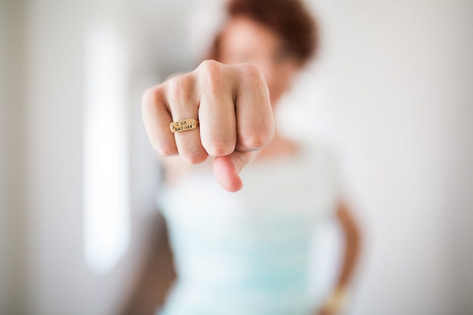

*Photo by Brooke Lark on Unsplash*

You're in a cozy café sipping coffee after a long yet rejuvenating day out with your bestie. You've shopped till you've dropped, eaten like there's no tomorrow and even walked miles together, a perfect way to end a stressful week. Your friend grabs your hand in the huge crowd so you don't get lost and even gives u a shoulder to sleep on in the metro! One thing's certain, You've never had a friend like him. For those of you who were surprised to know that it's a boy whom I'm talking about, you're not alone! The scenario isn't complete yet. He comes all the way to drop you home and hugs you before you leave. You look up only to find your nosy neighbor aunties staring at you like their eyes might pop out and you're a hundred percent sure that they're talking about you. You hear your mother talking to some random person who tells her that she saw you walking hand in hand with your "boyfriend" and that my mom had to learn to "control" me! All this just for spending less than 5 hours with someone you consider closer than family, not a guy you're dating. Would this be the same case if you hung out with a girl?

Would there be rumors spread about you? Would you be told to control yourself? This is just one of the thousand incidents a girl goes through without complaining. I've been told not to sit with boys in class by teachers, nor be close with them. "you're a girl, why don't you mingle with the other girls in your class?".

A bit about myself — I'm athletic, highly competitive, hyper active and carefree. I love challenging the boys in every way possible. Maybe I do stand out, and I'm proud of it. Nonetheless, that has been a major factor for me being judged. I get judged for mingling with the boys, being the only girl playing football with them, laughing with them, eating with them, to sum it up when I spend more time with them than what I spend with the girls of my age.

Then what are we supposed to do? Simple, we have to act like "normal girls", play by the rules of society, have fun but not too much so that others don't get the wrong idea, all in all be "ladylike" and never ask why we need to follow this!

Although this might seem like a very trivial matter, for anyone who has had to go through this, hear the nasty comments shot at them, listen the rumors spread about them and see the disgusting looks on everyone's face, it hits on a whole other level. One starts feeling that they're a disgrace to the society not knowing that the only one people who have to be embarrassed are those narrow minded jerks who make life a living nightmare for the others.

I wouldn't deny the fact that parents have to look out for the safety of their daughters. The world is still a cruel place and its ok to have curfews, restrictions and other precautions. However, changing yourself just for the sake of what others would think is insane. Becoming just another fake person to please the society is something we need to work on and change. When there is no such thing as an "ideal" person, why should we mold girls into someone completely different only to avoid judgments being passed? Unfortunately, We live in a society where one cant not care about the stuff happening around them.

This women's day, lets celebrate different forms of womanhood! Lets fight for independence not just in a physical sense but more importantly freedom to be who we want to be! Why have a status quo considering every single person is different. We have varied interests and like how two fingers can never be the same, it is highly ridiculous to expect every girl to act the same. Why use subjective terms like "being ladylike" and reduce the self confidence of young girls? We say our country is developing, but what about the mentality of people around us? Will that ever change? The only way to find out is by making our point clear.

I say we work for a non-judgmental atmosphere, a one where its common to have a boy best friend, where its alright to play anything you want even if you're the only girl there, one where you can talk ,joke ,swear and be as carefree as the men around us.

If you're one of them with such an old fashioned mentality, please bear in mind that when u go around judging them for no fault of their own, it not only shatters their confidence but also makes them and their parents a target in the society.

From this 8th of march, I want to freely be able to tell everyone that I'm proud of the sort of woman I am which I will never change and that I am not alone.

A very happy women's day to all the wonderful women out there and even to those of you who make our lives soo much harder with your long noses!

*Sincerely,*

*Anonymous 17 year old — volunteers with [CFAM](http://www.cfam.in)*
