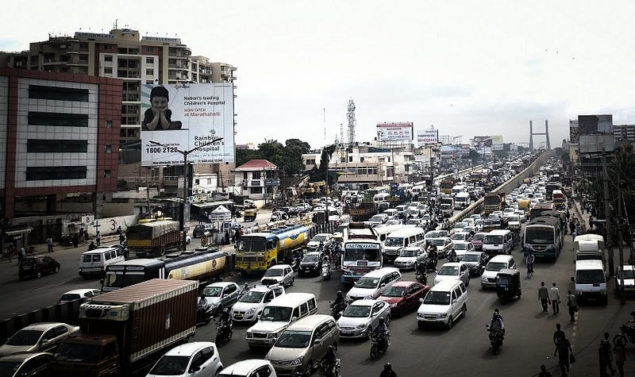
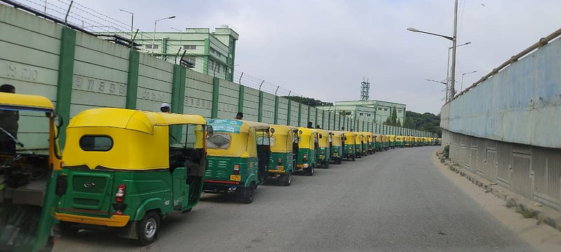

*Traffic Jam in Bengaluru. PC: Wikimedia Commons*

The yellow board on passenger vehicles have outlived their utility and are causing more harm than good. The carpooling controversy in Bengaluru brought out our inability to rethink the rules when faced with behaviour that run contrary to those rules. Newspapers, over the past few days, have been [reporting](https://www.moneycontrol.com/news/business/no-ban-on-carpooling-in-bengaluru-clarifies-govt-transport-minister-to-meet-aggregators-on-oct-3-11464611.html) that service providers who help people discover car pooling passengers via an app and charging for its use will be slapped with a fine since they use white board (private) vehicles for a commercial purpose. The commerce here is charging for passenger discovery and possibly payments between the driver and passengers as well. Current motor vehicle rules allow only vehicles registered as commercial vehicles, and display their number plate in yellow, to ply for any kind of exchange of money.

This however, has not prevented the last mile delivery services to operate with white board private vehicles since the person delivering groceries, packages and food is being paid. As an unintended consequence of switching to electric vehicles, the delivery vehicles have been plying with a green plate since there is no green/yellow combination in the rules. Historically, autorickshaws and taxis have been registered with a yellow plate. There is an inherent unfairness in this treatment that makes taxis ferrying passengers, go through extra norms forcing them to revolt. With food delivery services, and now carpools, this has come to the fore, as it was with bike sharing services [earlier](https://www.indiejournal.in/article/bike-taxis-become-reason-for-conflict-between-struggling-youth-and-auto-drivers). You don't see the taxi and auto drivers complaining against last mile delivery since they don't take away their passengers.

Traditionally carpool was done informally, with known friends that you privately discover in your company, or by word of mouth. If you wish to maximise your car usage you will begin to look for technologies, like apps, to connect you with more people you don't directly know. The apps might charge you a service fee to keep themselves going. It is unfair to expect that such services be free. If someone is willing to pay for this, we should allow that transaction to happen and not sit in judgement of the value exchange between the parties. It doesn't make sense for you to register your car as a yellow board to help discover more people, only for your commute, while the rest of your use of that vehicle is private.

> One of the ways to get past this is to decouple the vehicle from the driver.

*Vehicles waiting in line for Transport Office Fitness Certification. PC: WeAreHSRLayout*

The yellow board goes on the vehicle, ostensibly to check its fitness and collect a differentiated tax. With technology, it's entirely possible to move this fitness checks to the vehicle service centre. All vehicles have a fixed schedule provided by the manufacturer and are checked for their fitness in those service appointments. The service centre should be asked to upload the vehicle fitness data into the transport department website at those service checks, or at certain fixed intervals; like it is done for your income tax, property tax and GST filings. Only exceptions or consumer complaints need to be audited. This removes the need to have an interface with the government authorities and allows the government to do other important things, like building better infrastructure. The revenue gained from yellow board registrations of passenger vehicles, is not significant enough to warrant these complications. We aren't talking about cargo or goods transport vehicles here.

The other reason for yellow board is to certify and do constant checks on the driver, to prevent untoward incidents on passengers. But, untoward incidents are happening even with the yellow board. It is also observed that the driver of the vehicle is not even the owner of the vehicle in a lot of cases. The Metro Mitra Auto service [launched](https://www.thehindu.com/news/cities/bangalore/metro-mitra-app-finally-launched-in-bengaluru-now-available-in-jayanagar/article67353695.ece) in Bengaluru recently has a QR code which informs passengers of the credentials of the driver whose KYC is done. The taxi and auto rickshaws already display driver information, either in the app or in the vehicle. The enablers of passenger discovery via technology for carpool, could also be asked to perform KYC on the drivers and display the details prominently on the app, or physically in the vehicle.

> Each time we try to put a covering legislation like aggregator rules etc. on the fundamental flaws of the underlying act, it is only a band aid that leads to more exceptions.

Transport regulation is in the concurrent list. In case some state wants to take up such fundamental reforms, they can request that the central motor vehicle act allow the state motor vehicle act to override these rules. It is also important to note that Unified Metropolitan Transport Authorities, like the BMLTA in Bengaluru, should be taking up these reforms. By decoupling the driver and colour of the number plate on the vehicle, we can arrive at solutions that enable innovation to solve the broader problem of congestion on the roads. So it's essential to question some of the rules made in a different era. #NoMoreYellowBoards for passenger vehicles is a useful call to consider.
