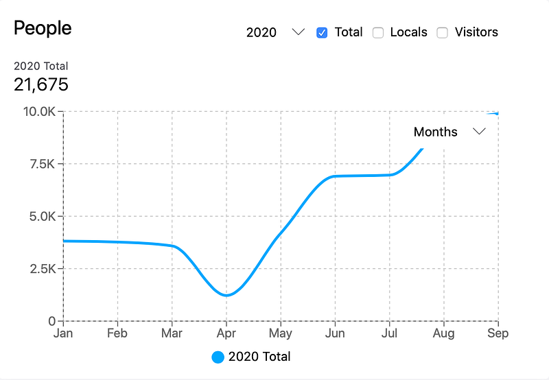
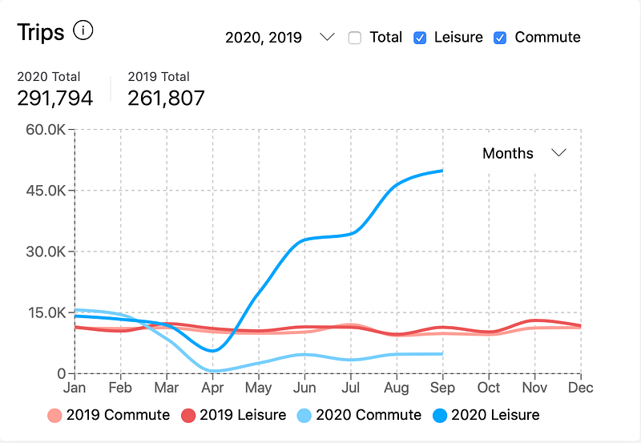

While the pandemic has been dangerous causing many fatalities across the world, it has brought to focus the frailties of human nature when it comes to collective action problems. There were forced lockdowns across India, starting late march, that highlighted clean air gains due to lack of emissions especially by motor vehicles in the city. Social distancing measures and closure of gyms kept people indoors, which meant lack of activity would take a mental and physical toll after a while.

Across the world this was a perfect opportunity to promote a clean, healthy and socially distanced personal transport vehicle called the bicycle. The window of opportunity presented itself and some of us in Bengaluru grabbed it with both hands, and legs.

[Strava](http://www.strava.com) is a tracking application used by sports persons worldwide. Bicyclists can tag their ride as commute or leisure. Strava created a platform called [metro](https://metro.strava.com), to provide useful insights to cities across the world on bicycle riding patterns and enable decision making on infrastructure. On the [CycleToWork](https://cycleto.work/leaderboard) platform we found a drastic dip in rides from the high thousands per day in January to practically nothing by March end, but something unique was happening on the streets that the Strava metro data validates for us.

*Source: Strava Metro for Bengaluru Urban Region*

In March, just a few days after the lockdown, we launched the #[ReliefRiders](https://sites.google.com/urbanmorph.com/urbanmorph/health/relief-riders) where more than 80 of us delivered essential supplies on the bicycle to the elderly and vulnerable. It was a huge success in bringing to attention the utility of the bicycle as an emergency response tool. People realised this was a good way to get back on their feet. Bicycle shops however, were still not an essential service and remained closed. In April, we launched the #[ResetWithCycling](https://sites.google.com/urbanmorph.com/indovelo/resetwithcycling) campaign and got permits to have cyclists exempted from having to show a pass and in early May, with unlock 1.0, the stores opened to roaring sales. Bicycles were flying off the shelves with more than 200% sales being reported by many stores. [The Bicycle Alliance](https://sites.google.com/urbanmorph.com/indovelo/the-bicycle-alliance) was launched, soon after, with the bicycle retailers to promote #VisionOneCrore. The idea of the campaign was to have one crore bicycles on the roads in Bengaluru. You can see the pattern in the Strava chart, the explosion of people on bicycles. This doesnt include people who don't use Strava, which will be many times more.

*Source: Strava Metro for Bengaluru Urban Region*

What the Strava data also reveals is that thoroughout the last year, leading up to the pandemic, commute and recreational rides were even ( Red lines for 2019). But with work from home being preferred, the recreational rides diverged exponentially (Blue lines for 2020). We also notice, in Bengaluru, the bicycle trips remain fairly constant through the year, instead of having any seasonal variations. This shows there is a culture of bicycling that has set in and is not a hobby activity.

This is the perfect time to up shift the commute trend line with infrastructure additions, to switch the new riders to work commute, as offices start opening up early next year. The pop-up bicycle lanes on the Outer Ring Road (where more than half the bicycling commuters on the CycleToWork platform are) and plans for Cycling District 1 from DULT, 30kms of roads being done under Smart City and a few more tenders already floated independently by BBMP will add tremendous value if they can be completed by March next year. It will be good timing, with the opening up of the work places and probably a vaccine as well.
