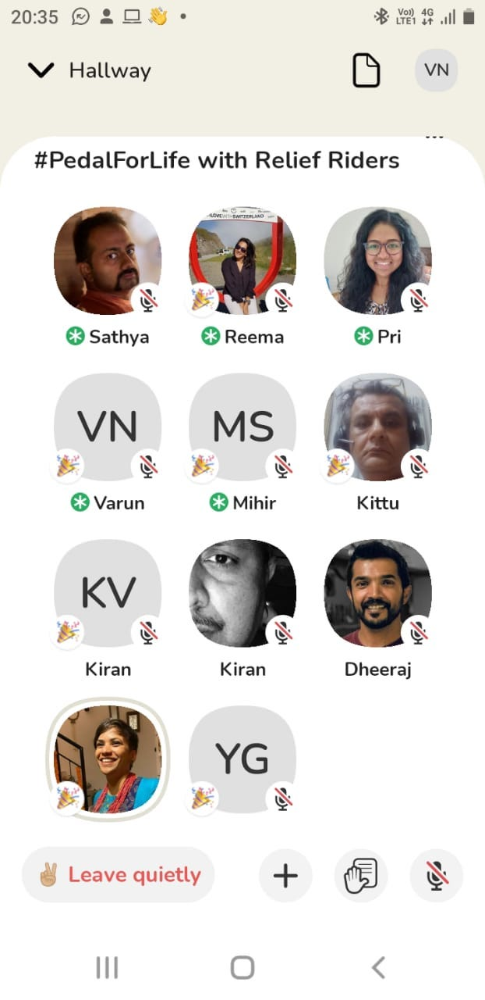

Clubbing our way on #WorldBicycleDay2021. Psst... Virtual thou. We hosted the first town hall of [#ReliefRiders](http://reliefriders.urbanmorph.com) on the Clubhouse app and had a ball of a time. Themed around #PedalForLife, the discussion was mostly around how cycling creates a positive impact in the long run. The agenda you may ask? Get to know each other better, understand the purpose of what we do, significance of #WorldBicycleDay, and together share in the great camaraderie.

Earlier in the day, we had launched the #PedalForLife campaign with a [video](https://fb.watch/5ZuKt-ZzWZ/) from prominent citizens providing their thoughts on the Relief Riders campaign. The speakers included, Polish track cyclist Leszek Sbiliski, the originator of World Bicycle Day, Grammy Awardee and UN ambassador Ricky Kej, Joint Secretary GoI and Director of Smart Cities Mission Kunal Kumar, Actor Prem Kumar and South East Asia Director of ITDP Shreya Gadepalli. There was also a [video](https://fb.watch/5ZuNU52Zna/) from Relief Riders and their beneficiaries, an emotional story of how they felt delivering and receiving help in these times.

On the Clubhouse chat, we spent the first and last 10 minutes in greeting people, setting the context for the occasion, and finally wrapping up on a happy note. But eventually lo behold, the conversations went on for almost 2 hours, concluding at 9:45 pm, and was attended by nearly 100 of us.

It was great to hear from Sathya Sankaran about inception and reason behind Relief Riders and #PedalForLife. Kittu Pakala handling operations shared some great learnings on how we managed to scale from 1 to 12 cities that are seamlessly managed. Also joined by other city leads from Mumbai, Chennai, Pune, Hubballi-Dharwad & Belagavi, each of whom weighed in on what they thought of the initiative.

Priyanka Pengonda of course had the most difficult task of letting people in and out of the Speaker room to ensure we had a lag free experience, with Reema Vazirani, Mihir, and Varun Nair from the Back Office team moderating the session and getting more riders to come in and share their stories. We did hear some fun moments from riders on how some of the tasks took them by surprise and rose to the occasion to ensure that the receiver got what they wanted in a short span of time.

Needless to say, we had a great time and that this surely is not the last of the Clubhouse chats from our end. We are #ReliefRiders and for sure are here to stay.

*Written with inputs from Varun Nair, Mihir, Reema Vazirani & Priyanka Pengonda*
