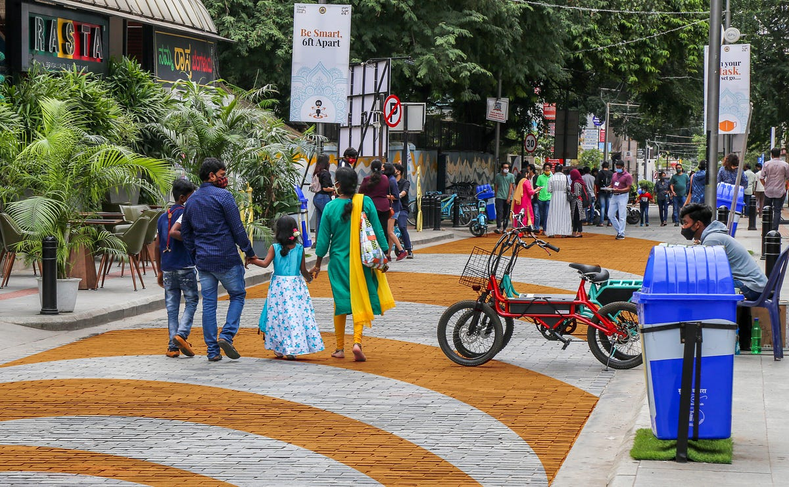
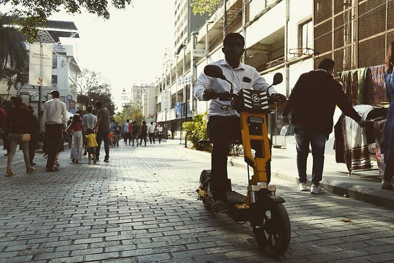
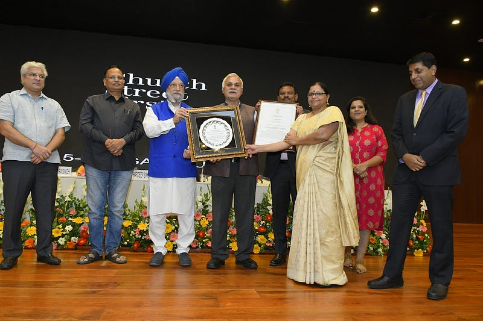
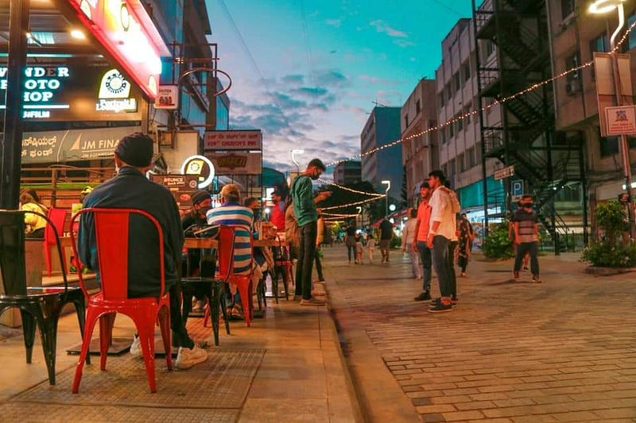
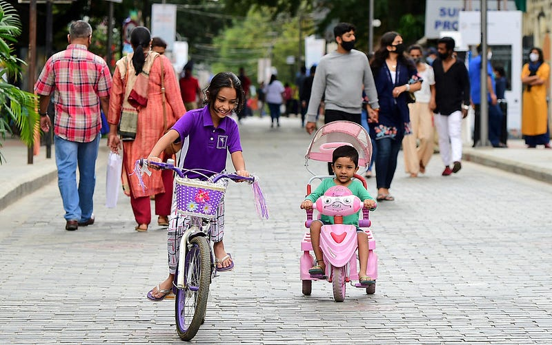

*PC: Directorate of Urban Land Transport*

In most cities around the world, streets make up around 80% of all public space. They are the lifeblood of urban life, and can enable cultural vitality, commerce, and a safe place to meet others, dwell, or simply move through comfortably when planned correctly. More often than not however, our streets have become hostile environments, dominated by cars and the noise, air pollution, and danger they pose to active users. Cities have recently begun to take important measures to reclaim these spaces, and shape streetscapes that support the quality of life of pedestrians and cyclists. One such initiative is Church Street First in Bengaluru, India, led by Directorate of Urban Land Transport in association with IISc, Bengaluru, Catapult, UK and Urban Morph Bengaluru which recently began a pedestrianisation program under the Clean Air Street Initiative that bore highly encouraging results, both for the city itself and for the development of urban good practices.

Church Street is already one of the busiest streets in the Central Business District of Bengaluru. When it was closed for vehicular traffic every Saturday and Sunday from 10:00 AM to midnight between November 2020 and April 2021, the 750m stretch of cobblestoned pavement, lush vegetation and bustling shops, bars and restaurants became even more alive than it has ever been.

During the first four months, a rigorous study of the pilot led to the publication of "[Church Street First — Impact Assessment of Pedestrianizing an Urban Street in terms of Quality of Life](http://urbantransport.kar.gov.in/CAS_Impact%20Assessment%20Report_IISc.pdf)" by Professor Ashish Verma and Ms. Hemanthini Allirani. While the results offer situated knowledge, they also reveal the value of pilot programs as a way of demonstrating the benefits of pedestrian projects for other urban areas. Their findings suggest that temporary closure improved air quality during weekends, increased foot traffic and public transport usage, and strengthened urban vitality and street user wellbeing.

### A tool for increased air quality & ambient noise reduction

It has been well studied that street closures improve air quality. During Los Angeles' open street event CicLAvia for example, a [UCLA air quality study](https://www.sciencedirect.com/science/article/abs/pii/S0269749115300579) noted a reduction of 49% of PM2.5 on route and 12% on streets off-route that were still open to traffic. Other pedestrianisation initiatives such as the Barcelona superblocks have also yielded promising results. In the San Antoni district of the Spanish city, [NO2 concentrations are now 33% lower](https://www.oneearth.org/barcelona-tackles-air-pollution-by-expanding-its-superblocks-street-plan/) in some of the intersections reclaimed by pedestrians, while noise pollution has also dropped by 4.1 decibels in the daytime and by 5.3 in the nighttime.

On Church Street, ambient PM levels were monitored using three Fixed Air Quality Monitoring Sensors (FAQMs) spread out at three locations, and observed an overall improvement in the air quality each month where weekends were closed to traffic compared to weekdays where traffic was admitted. 94% of the visitors agreed that reduced traffic noise because of a pedestrian-friendly environment improved their quality of life, and noted improvement in air quality due to road closure.

### Promoting sustainable transportation

*PC: Directorate of Urban Land Transport*

In only 3 months, pedestrian footfall on Church Street increased on average by 92%, and during peak times of 5pm-9pm that number increased to 117%. As more people became more aware of the initiative, they wanted to experience pedestrianized Church Street. Indeed, 78% of the visitors surveyed came to enjoy walking freely on the road, and 74% of the visitors were happy to contribute to the Clean Air initiative, as well as to experience new things on the street. These numbers reveal a demand for such pedestrianisation projects and a desire for vibrant streets that place people first. This was confirmed when 98% of the surveyed visitors stated that they felt pedestrianization was a good idea.

Additionally, a considerable shift to public transportation usage was observed among shop owners and visitors after pedestrianization. Nearly 7% decrease in the motorized transport modes was observed among visitors, while an increase in active and public transportation saw a 7% increase when compared to pre-pedestrianisation. For shop owners, this change was even sharper, with a 15% decrease in mode share of personal motorized modes and 11% increase in mode share of sustainable modes when compared to pre-pedestrianisation. Additionally, the MG Road metro station saw an increase of 162% more visitors on pedestrianised weekends. These numbers show how 'pedestrian-only streets' such as Church Street can thus also enable a shift towards public transit and non-motorized transport modes, and could impact travel behaviour citywide if scaled.

*PC: Directorate of Urban Land Transport*

> The initiative won the Ministry of Housing and Urban Affairs, Urban Mobility India 2021 commendation award and a special recognition by the Volvo India Innovation Awards 2021.

### Vital street life & thriving local businesses

*PC: Directorate of Urban Land Transport*

The pedestrianisation of a busy street to support healthy lifestyles and citizen-centric environments was the first of its kind for the city. Different activities were organized along the stretch of the street to attract people to the street and promote the project. More space for outdoor dining was enabled, a free women's cycle course was organised by the Bengaluru Moving campaign, public art exhibitions, dance and music events were held. For the first time in conjunction with Urban Morph the pedestrianised street was also used as a test bed for electric micro-mobility vehicles to emphasise cleaner fuels should replace dirty ones where necessary.

*PC: Directorate of Urban Land Transport*

Church Street became a favourite place for walkers and cyclists. It proved accessible to all age groups as many younger citizens, and disadvantaged people visited Church Street during the project. While these activities attracted people to the street, they also revealed a vision of what our streets could be if space was reclaimed for communities. Many people who frequented church street during the weekend initiative after a few weeks reported the tendency to walk on the street without concern for vehicles even during the weekdays by force of habit. Many [reported](https://twitter.com/nihart1024/status/1437458523974094852?s=20) not feeling like being on the street when there is traffic.

Church street being dominated by retail and F&B, commercial activity was also boosted because of this initiative. 70% of shop owners stated that pedestrianisation was a good idea. More than 50% of restaurant and shop owners noted an increase in customer footfall. Many new eateries opened up during the initiative and many who were planning to open later quickly reopened. The street which was desolate during the pandemic began to acquire a new life for both visitors and businesses.

### A model for what the city could be

Pedestrian streets are a way to showcase a future that prioritises quality of life as well as active and public transportation. The appetite for pedestrianised streets, open streets, school streets or car free Sundays has grown in the last decades and can today be found in many cities; along [Paris' riverbanks](https://www.trendingcity.org/europe/2013/7/22/2nt33s6akuufaprv7h5hyevh7uqumk), [Bogota's thoroughfares](https://www.bloomberg.com/news/articles/2018-10-02/bogot-s-ciclov-a-40-years-later-how-cycling-shaped-a-generation), [Addis Ababa's neighbourhoods](https://bycs.org/streets-for-people-with-seble-samuel/) or [Gurgaon's avenues](https://thecityfix.com/blog/gurgaon-launches-india-first-car-free-sunday-kanika-jindal/). They can be used as a tool to expose people not just to what people centric public space looks like, but what sustainable transportation feels like. Church street First blossomed into a healthier, and community-centric Bengaluru. The results are clear, and can provide a model for what the city could be: sustainable, active, safe, inclusive, and fun. Can Bengaluru lead this transformation by having a "clean air street" around every transit zone and in every neighbourhood?
