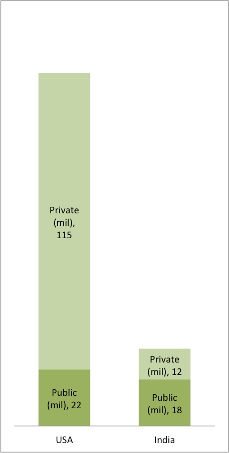

*By Codell (The uploader) [Public domain], via Wikimedia Commons*

We have been told growth is about investing in large infrastructure projects. The bullet trains, The elevated corridors across town. These are symbols of development. But the real story of growth is strong human capital and administrative institutions. Ethical and transparent administrative institutions enable growth and equity in society. Corruption and rent-seeking are regularly pulling down our economy.

*Organised sector jobs. India source: RBI*

This graph is telling. In India the public sector contributes to 60% of the organized labour market. You will notice that for a country which is 4 times the population USA, the number of government employees is not the problem, it's the size of the private sector. The small enterprise in India faces so many hassles everyday that they prefer to remain small and unorganized.

Every day there are stories of how the local corporator or MLA wants a cut in the sidewalk project or he stalls it. Corporators and MLA's are known to look for money in approving projects for startups working in public spaces. Linguistic groups approach retail stores and extract money. Police regularly extract protection money to regularise violations. Each one of these prevents many others from starting up at all. The tales run deep. Very few escape unscathed.

A study conducted by Transparency International in 2005 recorded that more than **92%** of Indians had at some point or another paid a bribe to a public official to get a job done. Their 2017 Corruption Perception Index ranks India 81st place out of 180 countries. How much does this affect us? A study conducted by the UK-based NGO, ONE, [found](https://www.hindustantimes.com/india/india-losing-1-trillion-annually-to-corruption-study/story-uK7Q0iC9mlEdr7Lld2rVCM.html) that developing countries such as India are losing **$1 trillion** every year through corruption. Every 1% increase in corruption level reduces the growth rate by .72% (Pak Hung Mo, 2001).

So let's not live under the impression that elevated flyover projects are going to provide the 20 million jobs that are needed to be created every year. It's only going to come from better ethical governance and less greedy public who take advantage of it. Our ethics will define our place in the world.
