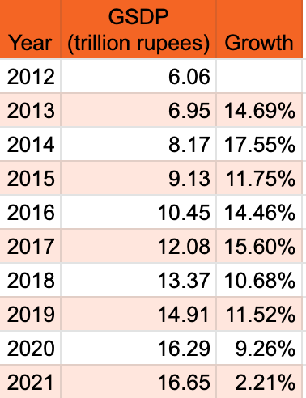

*Photo by Jess Bailey on Unsplash*

The pandemic and climate emergency provide us an opportunity to not be where we find ourselves today. Stuck in homes looking for things we left behind in 2020. However, the old normal is not going to get us to where we need to go. The old normal is what got us to this situation in the first place. Hence going back to old habits would be foolish. As we begin a budget session in 2022 after two years of saving lives and scrambling to shore up our public health infrastructure, we have an opportunity to decide if we can create a version of progress that shapes the future instead of just following the past. This, however, hinges on the government deciding to embark on a journey to redesign two things. The infrastructure we build and the systems that will enable it.

*Karnataka GSDP from statisticstimes.com*

It hasn't been a great two years for the state as the growth chart indicates. Yet, Bengaluru, which contributes more than 40% to the state GSDP is the only Indian city [ranked](https://inc42.com/buzz/bengaluru-ranks-23rd-in-global-startup-ecosystem-list-delhi-on-36th/) in the top 30 global startup ecosystems. How do we leverage this advantage and make the rest of the state catch up? Like it or not, Tier 2 cities are following in Bengaluru's foot steps, making the same mistakes the capital city is doing. Unless we correct the folly of our ways we are leading the entire state into ruins.

First, with work from home continuing to play a major role, take this time to upgrade major roads in Bengaluru. But this time to Tendersure quality with priority on walking and cycling. While major roads constitute just 20% of the total road network of the city, it will carry 80% of the road traffic. This will mean a budget of Rs. 1,800 crores every year for the next 10 years. Repeat this for the next 10 cities in the state in parallel. This reprioritisation will reset the way we move and catalyse economic growth across the state. If done well you can begin to witness the change towards climate friendly walking and cycling right after the first 300kms in the first year in Bengaluru alone. Vehicular traffic trips will reduce and flow smoother as well.

Second, redesign governance by passing the Bengaluru Metropolitan Land Transport Authority — [BMLTA bill](http://urbantransport.kar.gov.in/Draft%20BMLTA%20Bill%20-%20September%202021.pdf), [Active Mobility bill](https://dult.karnataka.gov.in/uploads/media_to_upload1640773786.pdf) and kickstart implementation of the Transit Oriented Development — [TOD policy](http://urbantransport.kar.gov.in/Draft%20Bengaluru%20ToD%20Policy%20with%20Annexure.pdf). Without increase in public transport coverage and adoption, the cities will very soon choke up. Bus, Suburban Rail, and Metro in Bengaluru, Bus Rapid Transit Systems in Huballi-Dharwad and the planned one in Belagavi will need tight integration between each other and with last mile to succeed. These three governance measures will help increase public transport uptake and catapult the state up in the league internationally.

> All three policies are revolutionary and Karnataka will be the first in the country to implement these.

So, is ಮರುವಿನ್ಯಾಸ - Redesign possible in this budget session? Will we make history or remain stuck in the past?
