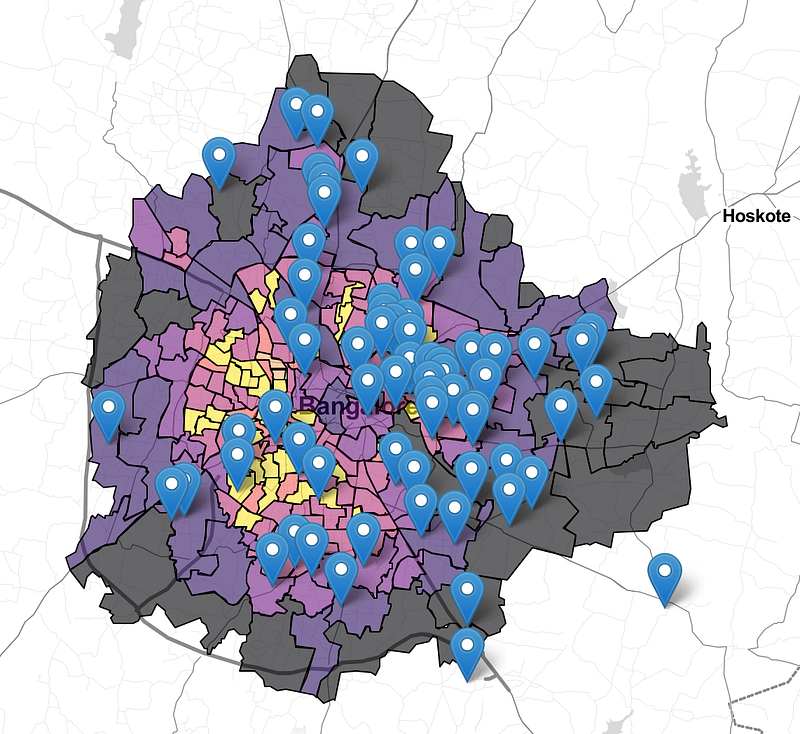
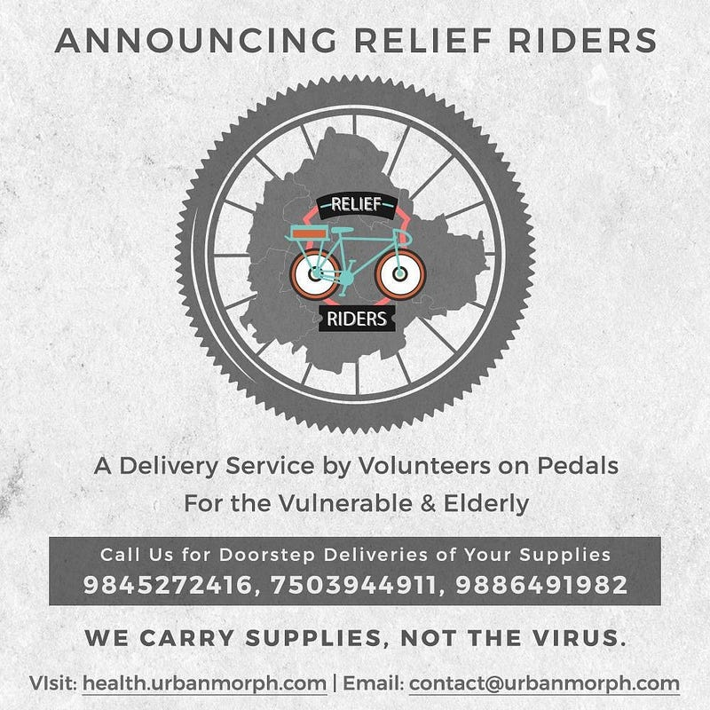

A nation wide lockdown in India owing to the COVID-19 pandemic was imposed on 24th March 2020. Since then movement of vehicles have been severely restricted and only a few shops in the neighbourhood are being allowed. This has caused a deficit in supply of essentials from the normal. The most vulnerable population to the infection are the elderly and people with medical conditions. Their fatality rates are higher. They have been disproportionately affected by this lockdown. They find it difficult to procure essentials because of distances they need to walk.

> The online platform <https://cycleto.work/leaderboard> has attracted more than 270 companies clocking more than 75 thousand trips.

I was selected as the first Bicycle Mayor of Bengaluru in May 2018 by [BYCS](http://Bycs.org), an Amsterdam based NGO. I'm one of the more than 100 Bicycle Mayors across the globe who are trying to shift transportation in cities to the bicycle. The 50 by 30 goal set by BYCS, provides an aggressive target for the Bicycle Mayors to achieve 50% trips on bicycle in their city by 2030. The #CycleToWork campaign I launched on 22 Sep 2018, International Car free day has catalysed work commute in the city using technology based gamification. I nominated Bicycle Ambassadors in each company to scale the leadership at the company level. It's these ambassadors who came in handy during this COVID-19 crisis.

The COVID-19 lockdown in the city of Bengaluru brought down pollution [by 60–65%](https://www.deccanherald.com/city/top-bengaluru-stories/covid-19-lockdown-improved-bengaluru-air-quality-state-pollution-control-board-821739.html) and emptied the streets because of reduction in vehicular traffic. Offices were closed and the cycle commuters were resigned to work from home. I offered them a chance to put their pedals to good use by asking if they would volunteer to ferry essential supplies to senior citizens. Essentials included Medicines, Groceries, Milk, Bread etc that can quickly be carried on a bicycle

*Map by Chintan Sheth & Pavan Kaushik*

The very first map of volunteers started with 22 people mostly from #CycleToWork. After one week 66 volunteers are on a WhatsApp group watching for requests to run sorties for the vulnerable. There are more cyclist volunteers asking to join the team. The word spread from the cycling ambassadors to other recreational cyclists and local bike stores. From carrying medicines to loading up their bicycles, with as much groceries and medicines as they can, they perform sorties everyday and report on the group with enthusiasm and motivate others. A 15 minute orientation program before onboarding each person is conducted by me over phone to ensure everyone understands the rules and operate in sync without formal structures.

The Relief Riders are completely decentralised bunch of volunteer cyclists, which meant passes were not really required as they don't travel too far to do any deliveries. We have tied up with the Bengaluru Police 1090 elders helpline which also routes some of their requests to the Relief Riders. Conversations are also on with the Department of Information and Public Relations (DIPR) to see if the maps data and workload can be shared.

> The tag line of the group is "We carry supplies, not the virus".

*Poster design by SYNERGOStech*

Safety isn't just an afterthought. Providing this in the tagline establishes trust and ensures we abide by it. Each volunteer is told to wear a mask, carry sanitisers and clean hands, keep distance from the senior citizen and ensure we are not transmitting the virus. This has been extremely successful so far.

Technology has been an enabler in quickly getting started. The WhatsApp group has all the volunteers cheering each other on with pictures and status update of sorties. After each sortie the volunteer fills a google sheet with the details of the trip and some even clock it on a tracking application called Strava and tag it with #ReliefRide for further analysis. This allowed the team to figure out that, after a week, the volunteers had covered 27 of the 198 wards across the city. Beyond doing sorties on their bicycle, the volunteers also stepped up with other tasks, three of them volunteered to channelise calls so the technologically challenged elders dont have to wade through website for numbers. Another volunteer who runs a digital marketing agency offered to help with making a poster with these numbers so it can be circulated across the internet. Another volunteer who was a data scientist, along with his colleagues, offered to map the senior citizens in every ward so we could target our efforts better. An urban planner was helping stitch all these together from the start so the execution in the backend remained tight despite me taking 6 hours everyday, outside of quick sorties, to make calls, onboard volunteers and put together critical information for the [world to see](https://sites.google.com/urbanmorph.com/urbanmorph/health/relief-riders)

> The wards served & volunteer list is growing everyday and the sorties are being added without a single ounce of carbon emission added.

The story of the bicycle is not over, it's still being written. What we do in this crisis will dictate how the bicycle is used in the future. So far the city and the country has been ignoring it. #ReliefRiders have proved it again, during this crisis, that there is definitely some place good that the bicycle can take us. The world's cities just need to give it a chance to be its knight in shining armour.
