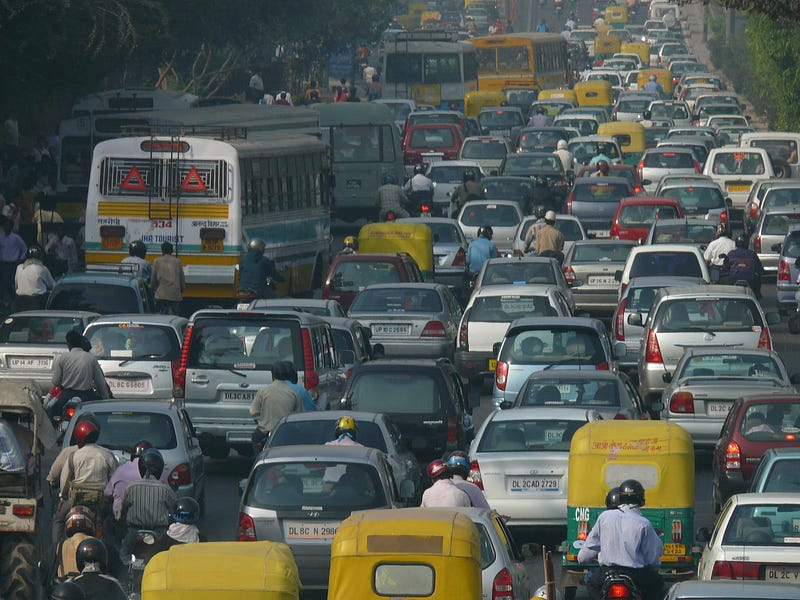

*PC: Flickr by N-O-M-A-D*

Bengaluru, like other cities in the country, has been creating transport agencies as different modes of transportation appeared over the years. The government of Mysore State formed the Bangalore Transport Service in 1956 by taking over a company with a private fleet of ninety-eight buses operating since 1940. Now called BMTC, it carried thirty-five lakh people every day pre-covid. The government created a company called Bangalore Mass Rapid Transit Limited in 1994 and started collecting money from citizens to fund the Elevated Light Rail Transit System. People were already paying a cess on petrol for thirteen years before the company that would finally build the Metro in Bengaluru — the Bangalore Metro Rail Corporation Limited (BMRCL) — came into existence, superseding the earlier entity which collected the cess. The suburban rail campaign, led by Praja which I was a part of, culminated a decade later, in 2020 with the creation of the Suburban Rail Authority called K-RIDE. By now, the city was [registering](https://timesofindia.indiatimes.com/city/bengaluru/vehicle-growth-rate-in-bengaluru-slows-down/articleshow/64432978.cms) one thousand six hundred private vehicles every day and private transport aggregators were putting many shared vehicles on the road.

The infrastructure on which these vehicles run was in even worse shape with the city corporation — BBMP, the electricity company — BESCOM, the plumbing company — BWSSB and the private companies supplying anything from gas to internet digging up the city with fractured rules on who will fix it. In this grey area played the power and money brokers who can sell you permissions for a cost. It was then only a matter of time before all these showed up on the streets and in our lives. Here we are now in a fine mess, paying for it in time, health and money.

Shri Mohammed Mohsin drafted the Bengaluru Metropolitan Land Transport Authority bill in 2010 to give teeth to the committee that was formed in March 2007 to avail JN-NURM funds for procurement of buses. But the ministers didn't consider it important enough to table in the legislature. Based on a [position paper](https://www.scribd.com/document/332223575/UMTA-for-Bengaluru) written by me in Nov 2016, Praja, with the help of BMTC, [convened](http://praja.in/en/projects/7201/event/umta-now-stakeholder-workshop) the UMTA Now! consultation on 6 Jun 2017 to push forward the creation of a statutory integrated transportation authority called BMLTA. Ms Manjula V, ACS who is the current commissioner, has finalised the draft and pushed for it to be tabled in the assembly.

> Stop being afraid of what could go wrong and start being excited about what could go right — Tony Robbins

*So what does the current bill propose?* Bengaluru Metropolitan Land Transport Authority (BMLTA) is the proposed statutory authority to — ensure integrated transport planning, coordination amongst urban transport providers, and performance monitoring of urban mobility providers — so that commuters enjoy a high quality public transport provision in Bengaluru.

*Why is BMLTA required?* The current public transport providers act in silos with no incentives for coordinating their services for the benefit of the commuter. Last mile connectivity is lacking at metro stations, integration of tickets is still not possible and there is no walking and cycling access to metro stations. BMLTA will ensure that all stakeholders are planning coherently, identifying right projects that are implemented to high-quality standards and are held to account for urban mobility outcomes.

*How is BMLTA going to improve public transport?* BMLTA will implement an integrated framework to identify gaps in the provision of public transport and plan interventions that will clearly improve it. BMLTA will prepare a Comprehensive Mobility Plan which will guide all stakeholders, identify interventions and state expected outcomes so that they hold transport providers to account for their performance.

> BMLTA will ensure accountability through an assessment against Annual Implementation Plan which each of the stakeholder should submit to BMLTA.

*Who will run BMLTA?* BMLTA will be a statutory authority with the Chief Minister as the Chairperson so that urban mobility through public transport gets the highest attention. BMLTA will ensure adequate representation from civil society, academic institutions, professional bodies, and experts. The day-to-day functions of BMLTA will be under the CEO, assisted by an Executive Committee. BMLTA, also has to ensure land use transport integration to get a compact urban form. A political person is the chairperson of the BDA and having the Chief Minister as BMLTA head will enable effective decisions on trade-offs and ensure land-use, sustainable transport integration.

*Where are we currently on BMLTA?* The [draft BMLTA Bill](http://www.urbantransport.kar.gov.in/Draft%20BMLTA%20Bill%20-%20September%202021.pdf) is ready, and DULT is hoping that in the winter session of the legislature beginning on 13th December 2021, will see it tabled and passed. DULT has also [published](https://dult.karnataka.gov.in/uploads/media_to_upload1638790949.pdf) salient features of the bill for easy understandability on their website. The Bill is definitely a step forward as currently there is no proper oversight at all on urban mobility providers.

In the future, a professionally structured BMLTA will evolve on the lines of TfL of London and LTA of Singapore and can provide us rich dividends which a city like Bengaluru deserves.
