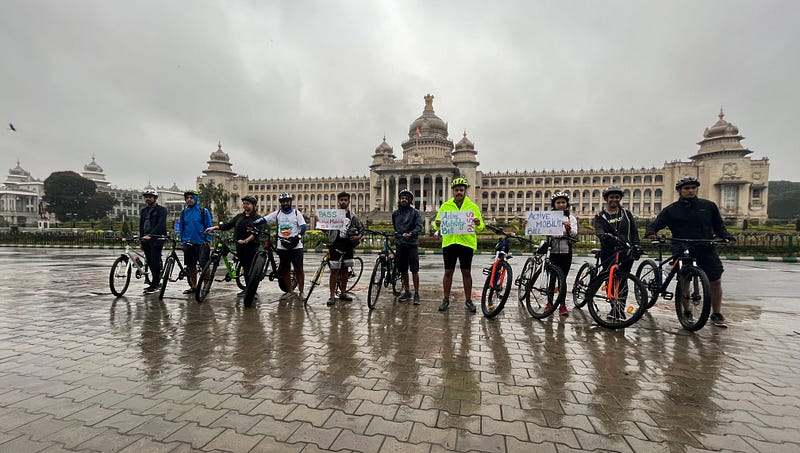

Karnataka has recorded the highest number of deaths in road accidents in India in 2020. According to the data released by National Crime Records Bureau (NCRB) 13% of pedestrian deaths in India were reported from Karnataka in 2020. Further, as per the World Resources Institute, as many as 907 pedestrians were killed in Bengaluru from 2017–2020. Moreover, in the last three years, more than 110 cyclists were injured and as many as 28 killed in road accidents in Bengaluru alone.

With the aspiration of enhancing liveability in the cities across Karnataka and improve Air Quality Index towards achieving the Prime Minister's vision of **"Mission Life"** that focuses on an environmentally conscious lifestyle by individual and community behavioural change and **"Green Growth"** that focuses on a holistic effort to the achievement of **net zero carbon emission by 2070**, a sustainable urban mobility mode is the need of the hour.

The Government of Karnataka had taken a milestone step by accepting the Transit-Oriented Development (ToD) policy drafted by Directorate of Urban land Transport (DULT) that envisages the vision of Bengaluru becoming a public transport-oriented city that is people and environment friendly and a city that supports economic growth while offering a good quality of life.

Further, the Ministry of Housing and Urban Affairs had launched multiple programs like '***Cycles4Change***' and '***Streets for People***' under the Smart City Mission in association with the co-host and coordinator ITDP, primarily to inspire the cities like Bengaluru to create permanent walking and cycling friendly infrastructure and to build momentum for the same. As per ITDP, investments in cycling infrastructure have economic benefits of up to 5.5 times the initial investment and cycling for short distances can result in an annual benefit of INR 1.8 trillion to the Indian economy.

The effort put up by social development motivated organisations and like-minded citizens have catalysed up to a certain extent by making the concept of active mobility and its sustainability intentions more popular among the public. ***#My15MinCity*** pledge campaign coordinated by Council For Active Mobility (CFAM), based on a residential urban concept, urges people to shun the motor vehicle for trips in the neighbourhood of their home. Out of the total people who pledged in the campaign, around 40% volunteered to help the same. It draws the conclusion that people are willing to instil an attitudinal change within their community and participate in the process.

For the first time in the country, ***'Pedal Shaale'*** has been started by DULT in association with Citizens for Sustainability (CiFoS) Karnataka Bicycle Dealers Association (KBDA) and Decathlon, to mould confident cyclists who can handle city traffics, which includes certified training for both participants and trainers. Around 15 trainers have completed their sessions and are equipped to impart necessary training to the participants and empower them.

CFAM had launched a campaign advocating for the '***Active Mobility Bill***' to be passed in the Karnataka Legislative Assembly and had successfully collected 4423 signatures on the Jhatkaa platform supporting the bill. The bill was drafted by DULT on 30 December 2021, which aims to protect the rights of pedestrians and cyclists across Karnataka's cities while granting safe spaces for sustainable urban mobility. RTI filings, social media campaigns and consultations with subject experts like doctors on the health issues of transport led emissions and EV private players on greener modes, were constantly carried out.

The concept of '***Slow Street***', an aspirational point within the Active Mobility Bill pioneered by DULT, restructures the streets by traffic calming and remodels it to be safer urban space for the pedestrians and cyclists. Following the efforts, Alexandra Street has been designated as Bengaluru's first slow street with the necessary signage to ensure the sensitivity towards pedestrians, cyclists and NMT users and is expected to reach out for greater community engagement and sensitisation. The DULT Slow Streets movement is being popularised by CFAM via Cycle Days and getting more residential organisations to take it up.

The '***Cycle Day'*** events are conducted by the Bengaluru Coalition for Open Streets (BCOS) and anchored by DULT, organized in an "open streets" format where a long stretch of the road is blocked to traffic for 4 hours on a Sunday to create a safe space for public to enjoy street activities and games. This is the longest continuously running open streets event in the country with more than 500 cycle days so far in Bengaluru and participation of more than 50 community partners.

Since Cycle Day served as a catalyst to generate required momentum for sustainable mobility in the city, there was a need to extend the community engagement of the government, which conceptualized ***Sustainable Mobility Accords*** (SuMA). The program focused on spreading awareness among the public on the benefits of sustainable mobility modes and to help the community to set specific goals by providing necessary support in the form of capacity building and assistance in showing measurable impact on ground. Karnataka Non-motorised Transport Agency (KNMTA) and DULT jointly coordinated the works that involved three broad phases viz. Data Collection and Analysis, Proposal preparation and Implementation. This has led to transformatory intervention in areas like Malleshwaram, Doddenakundi, Sanjaynagar etc.

In December 2015 Citizens For Sustainability (CiFoS) along with ESAF, BPAC and the schools of Sanjaynagar, a campaign, '***Walk To School'***, was organised in order to encourage students to commute to school by walk. The campaign acquired overwhelming response from the student community, wherein nearly 1500 students walked to their schools. The program was targeting the younger generations by setting a new normal and inculcating the necessity of choosing a greener mode of transit to schools. A survey after a year of this program found an increase of 32% in walking and 23% in cycling to schools.

Realising the dire need of footpath for the safe and smooth movement of people, with increasing urbanisation, skyrocketing consumption of private vehicles and increasing traffic congestions in Bengaluru, CiFoS had launched an advocacy program in 2017, '***Adjust Beda, Footpath Beku'*** ('Don't adjust, we want footpaths'). With the participation of more than 500 residents of Sanjay Nagar, the campaign aspired to replicate this model of community engagement and awareness for the city to be a liveable place. It led to the creation of 3 kms of walkable footpaths in Sanjaynagar.

***Church Street First*** was an initiative led by the DULT in association with IISC (Bengaluru), Catapult (UK) and Urban Morph that focused on pedestrianisation under the ***Clean Air Street*** Initiative. Within 3 months the pedestrian footfall in Church Street increased by 92% with more than 98% of the visitors and 70% of shop owners surveyed having an inclination towards the pedestrianisation of the street. The willingness of different stakeholders in the market paves the way for a permanent establishment of a street that prioritises pedestrians over vehicles.

Further, Bengaluru Political Action Committee (BPAC) had conducted a ***livelihood Cyclist's Survey***, in the form of questionnaire, to understand the challenges faced by the livelihood cyclists in Bengaluru along with their travel patterns and the important motivators for use of cycling as the primary mode of transport. With 604 respondents, primarily from low-income groups, around 62.13 % cited the absence of proper infrastructure and dedicated cycling lanes as the major concern while 13% feel upset at the unruly behaviour of other drivers. Around 70% feel that better lighting and 48% feel that designated cycle lanes are the encouraging factors to have a behavioural shift towards cycling.

Moreover, a mobility intelligence platform, '***AltMo***', was created by *Urbanmorph* for quantifying end to end sustainable transport modes towards achieving climate change goals. According to the data furnished by '*AltMo*', CO2 offset of 15885 Kgs were quantified in 2022 along with 6907 litres of fuel saved. It creates a leaderboard which lists out the employees and their companies (or workplace) that have driven the highest on cycle along with the data on the subsequent CO2 offset and fuel saved. This primarily targets the behavioural change on people and motivates them to replace the carbon-intensive transit mode with a greener, safer and healthier one.

In conclusion, there is significant community movement and initiatives that establish the enthusiasm and acceptance of Sustainable Mobility as a popular practice and not a flight of fancy of an underdeveloped country.

> With Bengaluru being counted among the top 10 innovation hubs of the world and attracting an international crowd it is time the elected representatives made it look like one by passing the active mobility bill and allocating a significant budget amount of Rs. 1000 Cr yearly towards walking & cycling infrastructure.

*Written by Ajay Nandakumar, YLAC Mobility Champion. Edited by Sathya Sankaran.*
