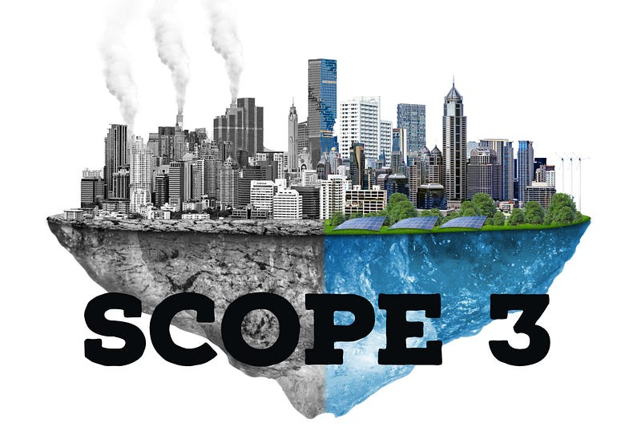
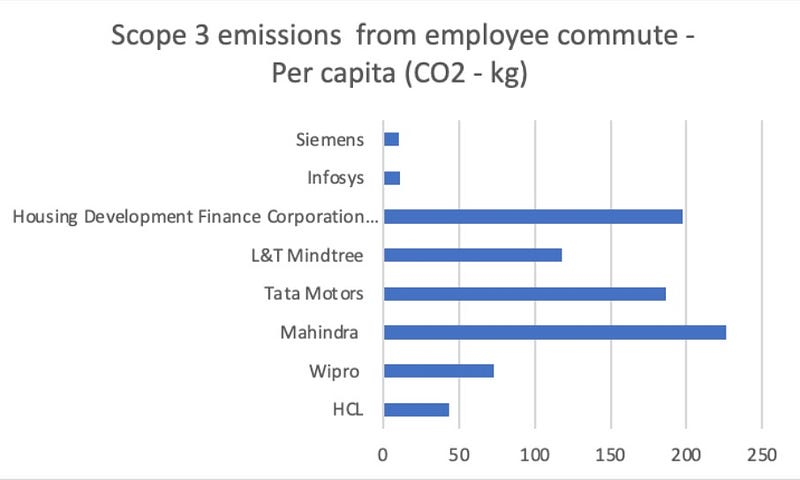

The Business Responsibility and Sustainability Report (BRSR) is a reporting framework for companies in India to disclose their sustainability performance. It replaced the earlier Environmental, Social & Governance (ESG) reporting framework called Business Responsibility Report (BRR) and BRSR is applicable to the top 1000 listed companies by market capital. While it was voluntary during FY 2022, Securities and Exchange Board of India (SEBI) has made it mandatory from FY 2023. One can foretell that once it is successful it will be rolled to all listed companies in the future. It is also useful to note that beyond SEBI compliance for listed entities, International contracts in many countries require even unlisted entities to be ESG compliant in their business along with reporting progress towards United Nations, Sustainable Development Goals (UN SDG's).

The BRSR has a section on environmental performance, which includes a disclosure on Scope 3 emissions. According to the GreenHouse Gas (GHG) Protocol, Scope 3 emissions are indirect emissions that occur in a company's value chain, including emissions from employee commuting. These emissions are often overlooked by companies, but can account for almost 80% of their overall emissions in certain sectors.

Employee commute includes emissions that arise from the transportation of employees between their homes and worksites. This includes automobile travel, bus travel, rail travel, air travel and other sustainable modes of transportation like cycling, walking, public transport, alternate fuels etc.

The BRSR also asks companies to disclose their emissions reduction targets and progress towards these targets. Specifically, it asks companies to disclose the percentage of employees who use sustainable transportation options, such as public transportation, cycling, or walking, and any initiatives to promote these options.

Reducing Scope 3 emissions from employee commute is critical for companies to achieve their net-zero targets. For companies that have set ambitious net-zero targets, reducing Scope 3 emissions from employee commute is essential. Without addressing these emissions, companies may find it difficult or impossible to achieve their targets. In addition, reducing emissions from employee commuting can have multiple benefits beyond reducing greenhouse gas emissions, including cost savings, improved employee health and well-being, and enhanced corporate reputation.

To understand the trends for Scope 3 emissions of the listed companies, we looked at the Integrated Annual Reports and Sustainability Reports of about 50 listed companies from the top 100 by market capitalization in India. Out of these 50% companies reported their total Scope 3 emissions and only around 20% reported the emissions from employee commute. Here are their numbers.

*Scope 3 Emissions from Employee Commuting per capita (CO2 — kg)*

The average amount of CO2 emitted per person from employee commuting in these companies is around 86.5kg per year. Some companies emit well over 226 kg of CO2 per person per year. You can tell the reporting is not accurate. The methods being used by each of them is producing wildly varying results even within a sector with typical size and working conditions.

With so many new metrics to measure and no defined way of measuring it, an ESG dashboard alone only puts the onus back on the company for data collection. This introduces more friction and overheads that doesn't solve standardisation or accuracy. Also, simply reporting metrics wont provide scope for changing the patterns and showing improvements. Action is required. Here are a few principles from [AltMo](http://www.AltMo.app) that companies can use to reducing their Scope 3 emissions from employee commute. Lets begin with the most famous Principle.

> Principle 1: You cannot manage what you cannot measure

**Measure emissions continuously**: Year end or quarter end scrambling for data only introduces more work and errors. Measuring more frequently using automation helps track progress effortlessly. Tools like [AltMo](http://www.AltMo.app) help in measuring sustainable commute. Live tracking and reporting by employees using personal and public vehicles is not as straight forward as putting GPS devices on company owned vehicles. [AltMo](http://www.AltMo.app) has put mechanisms in place to allow tracking by employees. We have built gamification features that helps companies incentivise sustainable behaviour using quantitive measures and increase self reporting. This brings us to Principle 2

> Principle 2: You should not have to collect data. It should be given to you.

**Set reduction targets**: Measurement allows companies to set targets dynamically and caliberate targets to different usage patterns and behaviours. Challenge features in [AltMo](http://www.altmo.app) promote climate action by allowing you to set time bound targets and steering behaviour of employees towards those targets. This can help to motivate employees and identify areas for improvement and engagement. This brings us to Principle 3

> Principle 3: Metrics will not change if you do not engage in the act of making the underlying behaviour change.

In conclusion, engaging in Scope 3 emissions not only benefits corporates but helps the city in general. Reduce handwringing about productivity loss, high pollution linked health costs, reduced liveability in the cities by acting now on employee commute. HR & ESG teams should be trying out tools like [AltMo](http://www.AltMo.app).

*With research inputs from Manaswini B*
