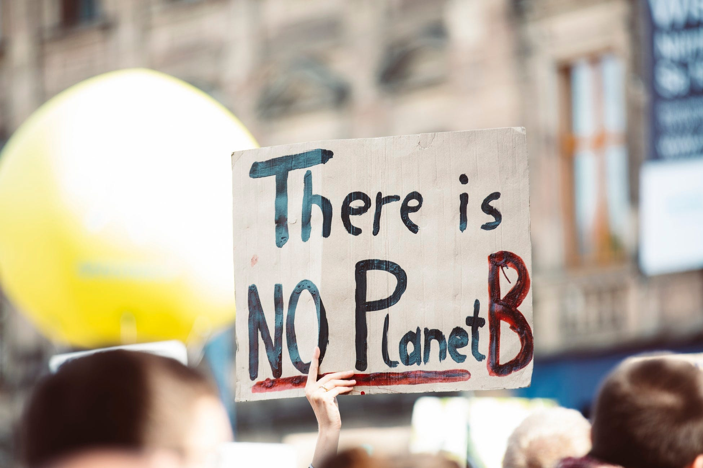

*Photo by Markus Spiske on Unsplash*

A couple of days ago, the interviewer from [BYCS](http://Bycs.org) asked me an interesting question. *Who is to blame for the lack progress in provisioning more infrastructure for climate friendly modes?* While the question was specific to cycling, it's useful to extrapolate to all climate change mitigation strategies. My immediate response was that the blame is all around. Our current practices in society, business and governance have been woeful and a huge contributor to this catastrophe. I thought I should deep dive into the blame game for a bit before we pin the ultimate responsibility.

> The primary responsibility for climate friendly behaviour rests with us as individuals and collectively as a society.

That statement is true but not a conclusion. An asymmetry of information influences the choices we make as individuals. The products we consume hide the true costs of our climate unfriendly choices behind layers of inputs. While the maker builds into the product the input costs, the environmental costs of the depletion of public-good resources like air and minerals are not. Many individuals, live in denial or have a bias towards making choices because of availability and tolerance of climate unfriendly behaviour in society. There are no consequences today for climate unfriendly behaviour. So people continue to accept the asymmetry of information and not take the pains to make the right choices. Some in fact embrace the status quo, unwilling to change their behaviour. Why are these choices still being made available to the irresponsible?

Manufacturers of products have invested in climate unfriendly products because fossil fuel based products are cheap or ubiquitously available. Climate friendly choices need to get into critical volume before it becomes cheap to be used in inputs. While some of them are trying to move to climate friendly materials at the risk of price competitiveness, many others, just like apathetic individuals, simply don't care. There are no consequences for climate unfriendly behaviour in business. Bans might lead to to greenwashing. Producer responsibilities need to be codified and penalties attached. But it's easier said than done. The people who understand the inputs are the manufacturers themselves. It requires comprehensive guidelines for each class of products before we see substantial results. It's possible to drive change, if people vote with their feet on such climate unfriendly products and practices. But, as we have seen, the individuals themselves are yet to come to grips in substantial numbers. Where does change making begin?

Governance. This is the reason it exists. To step in for market failures. Climate change is the single largest market failure facing our times. Is the governance doing enough? There are two types of governance: technocratic and political. Technocratic governance is the key to framing the policies that can get us to these goals. In many countries they are leading the way. In India there are pockets of brilliance in technocratic governance that are framing the future. But, market trajectories and political pressures hem them in. Technocratic intervention in the public space is also limited by structure.

The constitutional mandate places the buck at the political table. Here is where the leadership has become unimaginative. The quality of leadership at the political table has seen a slight uptick in recent times. But they ultimately are hostage to the wishes of the people they represent. Hostage sounds like a harsh word, because the reason they are in the position is to represent the people and their wishes. This is a good thing for constitutional democracy to thrive. It is natural that people will have divergent views.

> On an issue like climate change imaginative leadership can take in divergent viewpoints and yet achieve climate goals.

**I think the buck ultimately stops at the political class**. They haven't really made the right choices. This is primarily because of the plethora of interests that are lobbying for their favourite cause. The old economy measure of GDP being the primary lobby. If the political class formalises the principle that, across the board, climate change will drive decisions, a lot of these interests will align. The nuances and interplay need to be reconciled, but the principle needs to be codified to drive all decision making. Until we hear the clear and resounding statement from the top-down about this principle and actions that back it up, we have to leave the buck at the political class for unimaginative leadership in solving our most pressing problem: Climate change.
